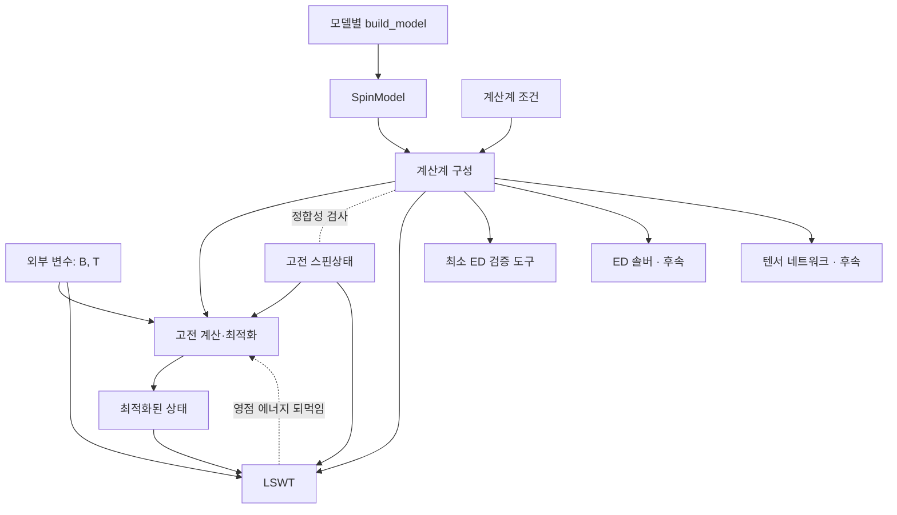

# 모델 간 공통 SpinModel 전달 규약

## Summary

NBCP, 사각격자·삼각격자 하이젠버그 등 모델별 생성 함수가 동일한 자료구조와
동일한 물리적 의미로 정보를 전달하도록 한다. 수신 모듈은 모델 이름으로 분기해
데이터를 해석하지 않고, 공통 필드와 지원하는 항의 종류를 확인한다.

이 문서는 모델·항·상태·계산 요청·결과의 **전달 규약**과 기존 코드와의 대응을
소유한다. 1차 개발 범위, 패키지 배치, 벤치마크, 구현 단계는
[[GOVERNMENT/Working-Pad/idea-proposals/2026-09-29-toolkit-first-development-plan|1차 개발 계획]]이
소유한다. 사용자가 결정한 항목은 아래 결정 목록의 ID로 표시하고, 표시가 없는 세부
필드명과 수치 규약은 검토안이다. 이 문서는 기존 물리 규약을 변경하지 않으며, 이론
정본의 승인 상태와도 별개다.

**구현 상태(2026-09-29, 1단계).** §2–§5의 모델·상태·외부 조건·계산격자 조건과 검증을
`code-space/spintoolkit/`에 구현했다(D16).

| 규약 | 구현 |
|---|---|
| §2 `SpinModel`, `Site`, `Term`, `Units`, §4 모델 검증, `fingerprint` | `system/model.py` |
| §5 외부 조건(`B`, `T`, 단위 환산) | `system/conditions.py`의 `ExternalConditions` |
| §5 계산계 실현(열역학 극한·유한 토러스) | `system/geometry.py`의 `CalculationGeometry` |
| §5 `SpinState`, §4 상태 검증 | `states/spin_state.py` |
| §1 기준 상태 진단 중 정상성(토크) | `methods/classical.py` |

결과 머리부, JSON 직렬화, 유한 토러스로의 항 전개, Colpa 안정성 진단은 아직 구현하지
않았다. LSWT는 아직 기존 `SpinSystem`을 입력으로 받는다(2단계에서 연결).

모델은 **해밀토니안**이다. 사이트별 스핀 크기, 상호작용 항과 장 결합 방식은
해밀토니안을 이루는 요소로서 모델에 속한다. 모델이 정의하는 것은 무한 주기계에서
항들의 병진 궤도, 즉 해밀토니안의 생성 규칙이다. 유한 클러스터의 연산자는 이
규칙을 계산계 조건에 적용해 얻는 별도 실현이다.

2026-06-04 IR 초안의 local space/site/term 관점을 유지한다. 항은 종류(kind)가
표시된 일반 형식으로 전달하되, 1차 범위에서 허용하는 종류는 **서로 다른 두
사이트의 실수 이선형 교환항과 Zeeman 항**으로 한정한다. 같은 사이트의 이차항,
3·4-스핀 항, 일반 그래프는 후속 확장 항목이다.

## 결정 목록

`docs/development` Beamer의 결정 기록과 같은 ID를 쓴다.

| ID | 내용 | 상태 | 위치 |
|---|---|---|---|
| D01 | 같은 물리 모델을 여러 계산 방법으로 전달하는 workflow | 방향 합의 | §1 |
| D02 | 모델 간 공통 필드와 동일한 의미의 전달 규약 | 방향 합의 | §2 |
| D03 | 모델 작업 공간은 작은 구성으로 시작 | 방향 합의 | 개발 계획 |
| D04 | 원시·중간 계산은 모델 작업 공간, 정돈된 결과는 `data-space/` | 방향 합의 | 개발 계획 |
| D05 | 분율 좌표·정수 셀 이동·단위 모드·항 수 규칙 | 규약 검토 | §3 |
| D06 | 실제 자료형 API(dataclass 생성자·직렬화) | D16으로 결정·구현; 직렬화는 4단계 | §2 |
| D07 | 1차 범위: NBCP와 두 하이젠버그 벤치마크, LSWT 물리량(위상량은 마지막 단계) | 사용자 결정 2026-09-29 | 개발 계획 |
| D08 | `terms[]` 형식: 형식은 열고 1차 검증은 `bilinear`·`zeeman`으로 닫음 | 사용자 결정 2026-09-29 | §2 |
| D09 | 모델은 g-텐서, 장 `B`는 외부 변수; Zeeman 부호 `-mu_B` | 사용자 결정 2026-09-29 | §1, §3 |
| D10 | 최소 ED 검증 도구를 `methods/ed/`에 두고 ED 솔버로 확장 | 사용자 결정 2026-09-29 | 개발 계획 |
| D11 | 패키지 `spintoolkit`, 별칭 `stk`; 키타에프는 후속 벤치마크 | 사용자 결정 2026-09-29 | 개발 계획 |
| D12 | 선택적 Zeeman 항, `g_(alpha beta)` 인덱스, relative 단위 `mu_B = 1`, 상태 검증과 기준 상태 진단의 분리 | 사용자 결정 2026-09-29 | §2–§4 |
| D13 | 표준 Fourier 부호와 전체 위치 게이지; NBCP 변위는 `r_target = r_source - d` | 사용자 결정 2026-09-29 | §3, §6 |
| D14 | 상태·계산 요청·결과를 공통·방법별 부분으로 분리; `SpinState`는 정수 초격자 `M` | 사용자 결정 2026-09-29 | §5 |
| D15 | 표준 벤치마크 모델은 `spintoolkit/models/`, 연구 모델은 `model/<name>/` | 사용자 결정 2026-09-29 | 개발 계획 |
| D16 | 1단계 API: `Term.bilinear`·`Term.zeeman` 생성 함수, (사이트, 셀)로 찾는 방향 dict, 위반 일괄 보고, `system/conditions.py`·`system/geometry.py`, 최상위 노출, JSON 직렬화는 4단계·`fingerprint`는 지금 | 사용자 결정 2026-09-29 | §2, §5 |

## Proposal

### 1. 전달 경계

| 객체·입력 | 소유하는 정보 | 다른 경계로 전달하는 내용 |
|---|---|---|
| `SpinModel` | 해밀토니안 기본 반복단위, 사이트별 스핀 크기, 항(교환·장 결합의 g-텐서) | 계산 방법에 독립적인 해밀토니안 정의 |
| 계산계 조건 | 열역학 극한 주기계 또는 유한계, 크기·형상·경계조건 | 모델을 적용할 물리적 계산계 |
| 고전 스핀상태 `SpinState` | 사이트별 방향과 자기구조 반복주기 | 고전 에너지 평가·최적화·LSWT의 기준 상태 |
| 계산 요청 | 외부 조건(장 `B`, 온도), 계산계 실현, 목표 물리량 | 해당 계산의 물리 조건 |
| 방법 설정 | 방법 선택, k점 격자·허용오차 등 수치 설정 | 해당 계산을 실행할 조건 |
| 결과 | 방법별 상태·스펙트럼·물리량, 단위·정규화·입력 기록 | 분석·시각화·저장에 필요한 결과 |

**외부 변수의 분류.** 모델 밖에서 바꾸는 입력을 해밀토니안과의 관계에 따라
구분한다(D09).

| 부류 | 예 | H에 들어가는가 | 변경 시 처리 |
|---|---|---|---|
| 해밀토니안 파라미터 | 모델 계수 `J`, `K`, `Gamma` 등 | 예 | 새 모델을 생성 |
| | 외부 장 `B` | 예(모델의 g-텐서와 결합) | 계산 요청에서 변경; 모델 불변 |
| 통계 조건 | 온도 `T` | 아니오(`rho ∝ exp(-H/k_B T)`) | 계산 요청에서 변경 |
| 계산계 실현 | 열역학 극한; 유한 클러스터 크기·형상·경계조건 | 유한 연산자의 힐베르트 공간과 항 집합을 결정 | 계산계를 다시 구성 |
| 수치 설정 | k점 격자, 허용오차, 최적화 초기값·반복 수 | 아니오 | 방법 설정에서 변경 |

LSWT에서 자기 브릴루앙 영역의 `N1 x N2` k점 격자는 `N1 x N2`개의 자기 단위격자로
이루어진 주기 경계 토러스와 같다. 열역학 극한 계산에서는 수렴을 조절하는 수치
설정이지만, 같은 유한 클러스터의 ED 결과와 비교할 때는 계산계 실현을 정한다.
결과에는 어느 의미로 사용했는지 기록한다.

**상태와 계산계의 관계.** 스핀 크기 `S`는 모델에, 방향은 상태에 속한다. 상태는
계산계와 독립적이지 않다.

- 유한 주기 클러스터에서는 자기 초격자가 클러스터를 빈틈없이 채워야 하며, 허용되는
  질서 파수벡터가 클러스터의 이산 k 집합으로 제한된다. 비정합 나선은 정확히
  표현되지 않고, 열린 경계에서는 사이트마다 다른 해가 나올 수 있다.
- 열역학 극한의 LSWT에서는 상태의 자기 단위격자가 계산 셀을 정한다.

따라서 둘의 관계는 한쪽 방향의 입력이 아니라 **정합성 제약**으로 검사한다(§4).
자기 초격자의 주기와 유한 계산계의 크기는 각각 기록한다. TN의 사이트 순서나
LSWT의 국소 회전축은 각 방법의 변환 단계에서 정하며 모델의 사이트 식별자를
덮어쓰지 않는다. LSWT 기준 상태의 정상성과 안정성은 §4의 기준 상태 진단에서 다룬다.

**상태 선택의 되먹임.** `methods/optimization.py`는 고전 에너지만 쓰는 최적화 외에
고전 에너지와 영점 에너지를 함께 쓰는 `quantum`, `MAGSWT` 경로를 제공한다. 고전
축퇴를 영점 에너지로 가르는 경우 흐름은 "고전 최적화 → LSWT"의 한 방향이 아니다.
결과에는 상태 선택에 사용한 에너지를 기록한다. ED·TN은 고전 기준 상태를 필수로
요구하지 않는다.



### 2. 공통 필드와 형태

Python의 명시적 자료형으로 표현한다. 아래 표는 필드의 의미를 정하는 것이며
아직 dataclass 생성자나 직렬화 API를 확정하지 않는다(D06).

| 경로 | 필수 여부·형태 | 의미 |
|---|---|---|
| `schema_version` | 필수, 정수 | 이 전달 규약의 버전. 최초 제안은 1 |
| `lattice.vectors` | 필수, 실수 `(2, 2)` | 각 행이 기본 격자벡터인 행렬 `A` |
| `sites` | 필수, 비어 있지 않은 레코드 목록 | 해밀토니안 기본 반복단위의 사이트 |
| `sites[].id` | 필수, 유일한 문자열 | 모델 내 안정된 사이트 식별자 |
| `sites[].position` | 필수, 실수 `(2,)` | `A` 기준 분율 좌표 `f`; Cartesian 위치는 `r = f @ A` |
| `sites[].spin` | 필수, 양의 정수·반정수 | 무차원 스핀 양자수 `S`; 국소 차원은 `2S+1`로 유도 |
| `terms` | 필수, 목록 | 각 병진 궤도에서 한 번 기록한 해밀토니안 항 |
| `terms[].kind` | 필수, 문자열 | 항의 종류. 1차 허용값은 `bilinear`, `zeeman` |
| `terms[].participants` | 필수, `(site_id, cell_offset)` 목록 | 항에 참여하는 사이트와 정수 셀 좌표 `(2,)`. 길이는 kind가 정함 |
| `terms[].coefficient` | 필수, 실수 배열 | kind별 계수. 형태는 아래 표 |
| `terms[].label` | 선택, 문자열 | NN·NNN 또는 x·y·z 등 의미 라벨. 수신 모듈은 이것으로 계수를 재구성하지 않음 |
| `units` | 선택, `Units` | §3의 에너지·길이 단위 선언. 생략하면 relative 에너지·길이 |
| `metadata.model_id` | 필수, 문자열 | 모델 식별·출처 추적용. 솔버 분기용이 아님 |
| `metadata.parameters` | 매핑, 생략 시 빈 매핑 | 적용한 모델별 입력 파라미터의 값·단위 |
| `metadata.sources` | 목록, 생략 시 빈 목록 | 파라미터·모델 출처 |

**1차에서 허용하는 항의 종류(D08).**

| kind | 참여자 수 | `coefficient` | 해밀토니안 기여 |
|---|---|---|---|
| `bilinear` | 2, 서로 다른 물리 사이트 | 실수 `(3, 3)` 행렬 `J` | `S_(R+n1,a)^T J S_(R+n2,b)` |
| `zeeman` | 1, `cell_offset = (0, 0)`; 사이트당 최대 하나 | 실수 `(3, 3)` g-텐서 `g_a` | `-mu_B B^T g_a S_(R,a)` |

`zeeman` 항은 계수가 고정된 항이 아니다. 모델은 장 결합 방식인 `g_a`만 담고,
장 `B`는 계산 요청에서 받는다(D09). `zeeman` 항은 선택 사항이다(D12). 항이 없는
사이트는 장과 결합하지 않는다는 뜻이며, 이는 규약으로 정한 의미이지 묵시적 기본값이
아니다. 계산 요청의 `B`가 0이 아닌데 `zeeman` 항이 없는 사이트가 있으면 수신 모듈은
경고하고 결과에 기록한다. `B = 0`인 계산에는 영향이 없다. 영행렬 항을 강제하지 않는
이유는 모델 작성 부담을 줄이기 위해서다. 영행렬 항의 계산 비용은 대각화에 비해
무시할 수 있다.

**형식은 열고 검증은 닫는다(D08).** 이 형식은 후속 kind(같은 사이트 이차항, 3·4-스핀
항 등)를 스키마 변경 없이 담을 수 있도록 연다. 그러나 1차 공통 검증은 허용 목록
밖의 kind를 명시적으로 거부하고, 각 수신 모듈은 자신이 지원하는 kind를 선언한다.
지원하지 않는 kind를 조용히 무시하지 않는다. 후속 kind의 계수 형태와 의미는 해당
kind를 도입할 때 정의한다. 같은 사이트가 반복되는 항은 `S`에 따라 의미가 달라지므로
(예: `S=1/2`에서 `(S^z)^2 = 1/4`) 별도 규약 없이 허용하지 않는다.

같은 물리 정보의 계산용 원본은 한 곳에 둔다. `coefficient`는 이미 평가된 수치이며
솔버가 `metadata.parameters`를 읽어 다시 계산하지 않는다. 함수 객체, 미평가 문자열
수식, 모델별 config 객체를 필수 계산 필드로 넘기지 않는다.

### 3. 좌표·스핀·단위·항 규약

**좌표(D05).** 기본 반복단위의 사이트 `a`와 셀 정수 좌표 `R`로 물리 사이트를
식별한다. 위치는 `(R + f_a) @ A`이다. 이선형 항 `(a, n1) - (b, n2)`의 실제 공간
변위는 `delta = (n2 - n1 + f_b - f_a) @ A`로 유도한다. 모델 입력에는
`cell_offset`을 보관하고 독립적인 `displacement` 값을 중복 저장하지 않는다.
분율 좌표의 자동 감싸기는 결합 셀 좌표까지 바꿀 수 있으므로 묵시적으로 수행하지
않는다.

**스핀축.** 모든 계수는 모델 전체에서 하나의 전역 Cartesian 스핀 성분
`(Sx, Sy, Sz)`를 사용한다. 스핀 연산자 정규화는 `S` 연산자 기준이며 Pauli
행렬 계수를 그대로 넣지 않는다. 원자료의 국소축이나 Pauli 규약에서 변환했다면
모델 생성 단계에서 변환하고 그 기준을 출처에 기록한다. 위치 공간 2차원과
스핀 공간 3차원을 구분한다. 구체적인 원자료 축 변환은 해당 모델에서 검토한다.

**Fourier 부호와 위치 게이지(D13).** 툴킷은 고체물리의 표준 부호와 전체 위치
게이지를 사용한다.

```text
a_(i mu) = N_uc^(-1/2) sum_k exp(+i k . r_(i mu)) a_(k mu),   r_(i mu) = R_i + tau_mu
```

source `a`, target `b`인 항의 호핑·이상 항 위상은 `exp(+i k . Delta)`이며
`Delta = r_target - r_source`이다. 부호를 반대로 택해도 `k`와 `-k`가 바뀔 뿐
스펙트럼 집합과 Chern 수는 같다. 위치 게이지는 선택에 따라 결과가 달라진다. 셀
위치 `R`만 쓰는 격자 게이지와 전체 위치 게이지는 에너지와 Chern 수가 같지만 국소
Berry 곡률이 다를 수 있다. thermal Hall 전도도는 밴드 에너지 가중치를 곱해
Berry 곡률을 적분하므로 국소 값의 영향을 받는다. 위치 정보를 포함하는 전체 위치
게이지를 쓴다. 이 식은 `docs/lswt` 운동량 공간 문서의 식과 같다. 다만 이 결정은
툴킷 규약에 한정하며, 이론 정본 notation 문서의 "Not Yet Fixed" 상태를 바꾸지 않는다.

**항의 의미.** 1차 범위의 해밀토니안은 다음과 같다.

```text
H = sum_R sum_(bilinear) S_(R+n1,a)^T J S_(R+n2,b)
    - mu_B sum_R sum_a B^T g_a S_(R,a)
```

이는 인터페이스 규약이며 새 이론 claim이나 실제 물질 모델의 정당성을 승인하는
수식이 아니다.

**Zeeman 부호와 성분(D09, D12).** 부호는 `-mu_B`를 사용한다. 스핀이 장 방향으로
정렬하는 자성 문헌의 관례이며, 현재 고전 에너지 코드의 `-h . S`와 부호가 같다.
기존 코드의 사이트별 장 계수와는 `h_a = mu_B g_a^T B`로 대응하며, 기존 NBCP 예제의
`h = g_z mu_B B`와도 부호가 같다. 성분 규약은 `g_(alpha beta)`가 스핀 성분 `beta`를
장 성분 `alpha`에 연결하는 것이다. Einstein 합 규약으로
`H_Z = -mu_B B_alpha g_(alpha beta) S_beta`이다.

**단위(D05, D12).** 물리 단위 입력은 에너지 `meV`, 길이 `angstrom`으로 정규화하는
안을 제안한다. `J=1`, `a=1` 같은 상대 단위 모델도 허용한다. 따라서 `Units`에는
`energy: meV | relative`, `length: angstrom | relative`를 명시한다.
상대 단위를 물리 단위로 환산할 근거가 있다면 양의 유한값
`energy_scale_meV`, `length_scale_angstrom`을 기록한다. 없으면 `None`으로 둔다.
물리 단위 모드에서는 별도 scale을 저장하지 않는다. 모든 항은 하나의 에너지 단위를,
모든 위치는 하나의 길이 단위를 공유한다.

장 `B`는 계산 요청에서 단위와 함께 받는다. 에너지 단위가 `meV`이면 `B`는 테슬라로
받고 `mu_B = 5.7883818060e-2 meV/T`를 사용한다. 이 상수는 구현 시
`definitions/constants.py`에 추가한다. 에너지 단위가 `relative`이면 `mu_B = 1`로
두고 `B`를 에너지 단위의 값으로 해석한다. g-텐서는 무차원이다. Kelvin 또는 SI 단위
출력에 필요한 scale이 없으면 해당 변환을 지원하지 않는다고 알린다.

**항 수와 중복(D05).** 각 항의 병진 궤도를 한 번 기록하고 위 식에 `1/2`를
추가하지 않는다. 전체 참여자의 셀 좌표를 같은 정수만큼 옮긴 레코드는 같은 항이다.
참여자 순서를 바꾼 레코드는 계수의 대응 인덱스를 바꾼 것과 같은 항이다. 이선형
항에서는 `(a, b, n, J)`와 `(b, a, -n, J.T)`가 같은 항이다. 공통 검증은 이런 중복을
확인한다. 같은 결합의 Heisenberg·Kitaev·DM 기여는 생성 단계에서 행렬로 합쳐 한
레코드로 전달한다. `J`에 대칭성을 강제하지 않는다. `a == b`이면서 셀 좌표가 다른
이선형 항은 허용한다. 같은 물리 사이트의 이차항은 별도의 연산자·상수 규약이
필요하므로 1차 범위에서 명시적으로 거부한다.

유한 주기계로 전개할 때는 서로 다른 병진 항이 같은 사이트 쌍으로 접힐 수 있다.
원래 항의 중복도를 보존해야 하며, 단순히 사이트 쌍을 set으로 만들면 안 된다.
전개 결과 자기 자신에 작용하는 항이 생기면 지원 여부를 확인하고 명시적으로 처리한다.

### 4. 생성과 검증 책임

```python
# Proposed interface, not implemented.
model = nbcp.build_model(parameters)
validate_spin_model(model)
```

모델별 생성 함수는 입력 파라미터를 해석하고 공통 표현으로 변환한다. 공통
검증은 모델 이름에 관계없이 동일하게 실행한다. 소비자는 검증된 계수와 연결정보를
사용하고, 지원하지 않는 항·기하·단위 변환을 명확히 거부한다.

| 모델 검증 | 조건 |
|---|---|
| 형태·유한성 | 벡터·행렬 shape 일치, 실수이며 NaN·Inf 없음 |
| 격자 | 서로 독립인 두 벡터; 퇴화 판정은 명시된 수치 허용오차 사용 |
| 사이트 | ID 유일, `S > 0`, `2S`가 정수; 각도나 상태의 길이로 사이트 수를 추정하지 않음 |
| 항의 종류 | kind가 1차 허용 목록에 있음; 참여자 수와 계수 shape가 kind와 일치 |
| 연결 | 모든 참여자 endpoint 존재, 셀 좌표가 정확한 정수; 실수를 묵시적으로 반올림하지 않음 |
| 이선형 항 | 병진·순서 교환 중복 검사, 같은 물리 사이트 반복 거부, 비대칭 실수 J 허용 |
| Zeeman 항 | 선택 사항; 사이트당 최대 하나; 셀 좌표 `(0, 0)` |
| 단위 | 선언한 공통 단위와 scale 제약 충족; 알 수 없는 환산계수는 추정하지 않음 |
| 독립성 | 모델 생성이 RNG·솔버 실행·파일 저장을 호출하지 않음 |
| 소유권 | 입력 배열을 복사해 보관; 반환한 모델의 배열을 소비자가 변경하지 못하게 보호 |
| 반복성 | 같은 평가된 입력에서 같은 모델 계수·연결 순서; 다른 기준상태를 선택해도 불변 |

상태는 모델과 별도로 검증한다. 상태와 계산계만으로 판정하는 **상태 검증**과,
모델과 외부 장 `B`가 있어야 판정하는 **기준 상태 진단**을 구분한다(D12).

| 상태 검증 | 조건 |
|---|---|
| 사이트 대응 | 자기 단위격자의 모든 사이트에 방향이 있고, 모델에 없는 사이트가 없음 |
| 방향 | 유한한 단위 벡터 |
| 자기 초격자 | 기본 격자에 대한 정수 행렬이며 행렬식이 0이 아님 |
| 계산계 정합 | 자기 초격자가 유한 계산계를 빈틈없이 채움 |
| 주기 최소성 | 선언한 초격자보다 작은 주기로 설명되면 알림(오류 아님). 밴드가 접혀 겹치면 밴드별 Chern 수가 모호해진다 |

| 기준 상태 진단 | 조건 |
|---|---|
| 정상성 | 주어진 모델·`B`에서 사이트별 토크 크기를 계산해 결과에 기록; 허용오차를 넘으면 경고 |
| 안정성 | LSWT에서 Colpa 조건(BdG 행렬의 양정치 여부)으로 국소 극소를 판정해 결과에 기록 |

LSWT의 기준 상태는 각 스핀이 국소장과 평행하여 토크가 0인 고전 정상점이어야 보손
선형항이 사라진다. 국소 극소가 아니면 허수 진동수가 나타난다. 기존 `MAGSWT` 경로는
불안정한 기준 상태를 화학 퍼텐셜로 정규화해 다루므로, 정상성 위반은 계산을 막는
오류가 아니라 결과에 기록하는 경고로 둔다. Goldstone 모드처럼 Colpa 조건이
경계에서 성립하는 경우는 상태의 문제가 아니라 LSWT의 영모드 처리 문제이며, 기존
구현 backlog에서 다룬다.

객체의 필드를 동결하는 것만으로 NumPy 배열 내용까지 불변이 되지는 않는다.
구현 시 복사와 배열 변경 보호를 함께 검증한다. 모델 계수의 변경은 새 모델을
만드는 방식으로 처리하고, 기존 계산에 전달한 모델을 제자리 수정하지 않는다.
외부 장 `B`의 변경은 모델을 바꾸지 않는다.

### 5. 상태·계산 요청·결과

세 객체를 모든 방법에 공통인 부분과 방법별 부분으로 나눈다(D14). 1차에서는 공통
계산 요청, 공통 결과 머리부, 고전 계산·LSWT용 `SpinState`, LSWT 결과 본문을
정한다. 최소 ED 검증 도구도 공통 요청과 공통 머리부를 사용한다. ED 결과 본문은
3단계에서, TN 관련 부분은 TN 도입 시 정한다.

| 객체 | 모든 방법 공통 | 방법별 |
|---|---|---|
| 상태 | — | 고전 스핀 배열 `SpinState`는 고전 계산과 LSWT 전용. ED·TN의 상태는 양자 상태로 별도 객체 |
| 계산 요청 | 외부 조건(`B`, `T`), 계산계 실현, 목표 물리량 | 방법 설정: LSWT의 k점 격자·regularization, ED의 대칭 섹터, TN의 bond dimension |
| 결과 | 머리부: 입력 출처, 단위·정규화, 진단 | 본문: LSWT의 밴드·영점 에너지, ED의 섹터별 고유값, TN의 수렴 정보 |

**`SpinState`.** 세부 필드명은 검토안이다.

| 필드 | 형태 | 의미 |
|---|---|---|
| `schema_version` | 정수 | 상태 규약의 버전 |
| `model_ref` | 모델의 `fingerprint` | 이 상태가 대응하는 모델 |
| `supercell` | 정수 `(2, 2)` 행렬 `M`, `det M != 0` | 자기 격자벡터의 행 = `M @ A` |
| `directions` | `(site_id, cell) → vector` 매핑(D16) | 각 사이트마다 `abs(det M)`개; `cell`은 초격자의 대표 셀 좌표; `vector`는 단위 벡터 |
| `provenance` | 기원과 선택 에너지 | 초기값·최적화·직접 지정; 선택에 쓴 에너지(고전, quantum, MAGSWT) |

방향은 단위 벡터로 저장한다(D12). 각도 표현은 극점(`theta = 0`)에서 `phi`가
정의되지 않으므로 저장 형식으로 쓰지 않는다. LSWT의 국소 좌표축은 방법의 변환
단계에서 정한다. 대표 셀은 `cell @ inv(M)`가 `[0, 1)^2`에 놓이는 정수 좌표이며,
`adj(M)`을 쓰는 정수 연산으로 부동소수점 오차 없이 계산한다.

현재 `CommensurateStructure`는 대각 초격자 `(n1, n2)`만 표현하므로 √3×√3 셀을
담지 못한다. 정수 행렬을 쓰면 NBCP의 기본 삼각격자
`A = [[1/2, √3/2], [1/2, -√3/2]]` 하나로 네 후보 셀을 모두 표현한다.

| 후보 셀 | `M` | `abs(det M)` |
|---|---|---|
| One MSL | `[[1, 0], [0, 1]]` | 1 |
| Two MSL | `[[1, 1], [1, -1]]` | 2 |
| Three MSL | `[[2, 1], [1, 2]]` | 3 |
| Four MSL | `[[2, 0], [0, 2]]` | 4 |

**계산 요청(공통).**

| 부분 | 내용 |
|---|---|
| 외부 조건 | 장 `B`와 단위; 온도 `T`와 단위. 에너지 단위가 `meV`이면 `T`는 K, `k_B = 8.617333262e-2 meV/K`; `relative`이면 `k_B = 1`이고 `T`는 에너지 단위 값 |
| 계산계 실현 | `thermodynamic_limit` 또는 `finite_torus`. 유한 토러스는 정수 클러스터 행렬 `L`로 주고, `L @ inv(M)`가 정수여야 한다. 원통·열린 클러스터는 TN·ED 솔버 도입 시 추가 |
| 목표 물리량 | 스펙트럼, 바닥상태 에너지, 열역학량, 상관함수, 위상량 중 요청한 항목 |
| 방법 설정 | 방법별. LSWT: 열역학 극한에서의 k점 격자 `(N1, N2)`, regularization(없음·MAGSWT), 밴드 경로, 허용오차 |

유한 토러스에서는 클러스터가 허용 k점을 정하므로 별도 k점 격자를 받지 않는다.
열역학 극한에서 k점 격자는 수렴을 조절하는 수치 설정이다.

**결과.** 공통 머리부와 방법별 본문으로 나눈다.

| 부분 | 내용 |
|---|---|
| 머리부 | `schema_version`, 방법, 입력 출처(모델·상태 해시, 계산계 실현, 외부 조건, 방법 설정, 코드·상수 버전), 에너지 단위, 정규화(에너지는 사이트당), 진단(정상성 토크, Colpa 안정성, Zeeman 누락 경고, 적용한 regularization, k점 격자의 의미) |
| LSWT 본문 | k점, 양의 밴드 에너지 `epsilon_n(k)`, `E_cl`, `Delta E_zp`, `E_GS`(사이트당), 필요 시 paraunitary 변환, 요청한 물리량 |
| ED 본문 | 3단계에서 정함 |

이 구조는 기존 `SolverResult`(`ground_state_energy`, `eigenvalues`, `spin_config`,
`data`)를 확장한다. 구현 backlog의 "k-data dict를 dataclass로 전환" 항목은 LSWT
본문 설계에 포함한다.

### 6. 기존 코드와의 연결

아래는 현재 구현의 관찰 결과이며 새 규약으로의 변환 완료를 뜻하지 않는다. 경로는
`code-space/spintoolkit/` 기준이다(0단계 이름 변경 후).

| 현재 코드 | 관찰 | 이행 시 요구 |
|---|---|---|
| `system/spin_system.py` | 사이트에 각도가 필수이고 position의 좌표 단위가 타입에 없음 | 공통 모델에서 상태를 분리하고 기존 입력으로 변환 |
| `system/lattice/base.py` | basis position을 분율 좌표로 설명함 | 현재 NBCP Cartesian 위치와의 변환을 명시 |
| `methods/lswt/energy.py` | J 항을 각 레코드마다 더하고 사이트별 장 계수 h 항을 뺌 | 중복계수·에너지 정규화의 회귀 검증; `h_a = mu_B g_a^T B` 변환 |
| `methods/lswt/hamiltonian.py` | 저장된 displacement로 Fourier 위상을 직접 계산함 | 변위 해석(아래)과 Fourier 위상·basis 변환을 함께 검증 |
| `methods/optimization.py` | classical 외에 `quantum`, `MAGSWT` 최적화 경로 제공 | 상태 선택에 사용한 에너지를 결과에 기록 |
| `model/nbcp/unit_cells.py` | 후보 자기단위격자와 결합·상태를 함께 생성, 각도 생략 시 난수 사용 | 모델 정의와 상태 생성의 반환 경계를 분리 |

**NBCP 결합 변위의 해석(D13).** `SpinSystem.Coupling` 설명은 displacement를
source→target이라고 적는다. 두 해석을 네 후보 셀에서 검사했다.
`examples/nbcp_y_soc_conditions.py::geometry_audit`도 Three MSL의 차이를 명시한다.

| 후보 셀 | 최대 정수 셀 잔차 `+d` / `-d` (2026-09-23) | 물리 결합 포함 `r_t = r_s - d` (2026-09-29) | 물리 결합 포함 `r_t = r_s + d` (2026-09-29) |
|---|---|---|---|
| One MSL | 1.11e-16 / 1.11e-16 | 6/6 | 6/6, 같은 결합 집합 |
| Two MSL | 0 / 0 | 12/12 | 12/12, 같은 결합 집합 |
| Three MSL | 0.3333333333333335 / 1.49e-16 | 18/18 | 9/18, 격자 밖 9 |
| Four MSL | 1.11e-16 / 1.11e-16 | 24/24 | 24/24, 같은 결합 집합 |

잔차 열은 NN 결합에 대한 `(ri ± d - rj) @ inv(A)`와 가장 가까운 정수의 최대 차이다.
NNN은 네 셀 모두 두 해석의 잔차가 4.45e-16 미만이었다. 포함 열은 NN·NNN 결합을
무방향·병진 동치의 물리 결합으로 모아 중복 없이 한 번씩 덮는 수다. 기하 검사만으로는
Three MSL 외의 셀에서 방향을 결정할 수 없다.

방향은 §3의 Fourier 규약으로 정해진다. 코드는 `K[i, j] += t exp(-i k . d)`로 위상을
계산한다. 이것이 규약의 `exp(+i k . Delta)`와 같아지려면 `Delta = -d`, 즉
`r_target = r_source - d`이다. 따라서 기존 코드는 저장된 `d`를 `r_source - r_target`으로
일관되게 사용하며, 틀린 것은 "source→target" 설명으로 판단한다. NBCP의 DM 항은
코드에 있지만 호출자가 설정하지 않아 0이므로 J는 대칭이고, 방향 해석이 에너지를
바꾸지 않는다.

변환 규칙은 `cell_offset = (r_source - d - r_target) @ inv(A)`를 정수로 확인한 뒤
쓰고, J와 source·target은 그대로 두는 것이다. 단순한 필드 이름 변경이나 전역 부호
반전으로 대신하지 않는다. 2단계에서 변환 전후의 `H(k)`가 원소 단위로 같은지 확인해
이 해석을 수치로 확정한다. BdG 행렬의 행이 생성 연산자 쪽이라는 가정도 이 비교에서
함께 확인된다.

## Rationale

공통 자료구조의 경계를 먼저 정하면 모델별 코드가 작아도 수신 모듈에 일관된
정보를 전달할 수 있다. 공통 모델과 기준상태를 분리하면 LSWT에 필요한 각도
때문에 ED/TN의 모델 정의가 왜곡되지 않는다. 명시적 셀 좌표와 단위는 기존
문자열 키나 주석만으로는 판별하기 어려웠던 해석 차이를 드러낸다.

항을 kind가 표시된 일반 형식으로 전달하면 ED·TN처럼 연산자 곱을 조립하는 방법이
후속 항을 스키마 변경 없이 받을 수 있다. 1차 검증을 허용 목록으로 닫으면 LSWT와
고전 계산은 두 종류의 항만 다루면 된다. 장을 g-텐서와 외부 변수 `B`로 나누면
장을 바꾸는 계산에서 모델을 다시 만들지 않아도 된다.

## Open Questions

- 새 필드명과 정규화 단위의 구체안은 검토 전이다(D05, D06). 큰 구조의 합의와 구분한다.
- NBCP 변위 해석(`r_target = r_source - d`)은 2단계의 `H(k)` 원소 단위 비교로
  수치 확정한다.
- ED 결과 본문(3단계)과 TN 관련 상태·요청·결과(TN 도입 시)의 필드 규약.
- 후속 kind(같은 사이트 이차항, 3·4-스핀 항)의 계수 형태와 의미. `S`에 따른 환원,
  `S >= 1`에서 사중극자 자유도에 대한 LSWT 처리(SU(N) 일반화 여부)를 함께 검토한다.

## 변경 이력

- 2026-09-23 (codex): 최초 작성.
- 2026-09-29 (claude): 사용자와의 검토 결과를 세 차례 반영했다. 1차 범위와 해밀토니안
  모델 정의, 외부 변수 분류, `terms[]` 형식, g-텐서와 외부 장, Zeeman 부호(D07–D11);
  선택적 Zeeman 항, `g` 인덱스, relative 단위, 상태 검증과 기준 상태 진단(D12);
  Fourier 규약과 NBCP 변위 해석, 상태·요청·결과 구조, 벤치마크 위치(D13–D15).
- 2026-09-29 (claude): 1단계 구현을 반영했다. 구현 상태 표와 D16을 추가하고, 구현한
  필드 이름(`Units.energy`·`length`, 생략 가능한 `metadata.parameters`·`sources`,
  `fingerprint`를 쓰는 `model_ref`, dict 형태의 `directions`)을 규약에 맞췄다.
- 2026-09-29 (claude): 문서를 정리했다. 1차 범위·패키지·벤치마크·구현 단계를
  [[GOVERNMENT/Working-Pad/idea-proposals/2026-09-29-toolkit-first-development-plan|1차 개발 계획]]으로
  분리했다. 결정 목록을 추가하고 본문의 날짜 표기를 결정 ID로 바꿨다. 정상성 설명과
  방향 저장 규약의 중복을 합치고, 두 변위 재검사 표를 하나로 합쳤으며, 이미 해소된
  "Fourier 규약을 확정하지 않는다" 문장을 정리했다. 내용은 바꾸지 않았다.
- 2026-09-29 (claude): 0단계 이름 변경에 맞춰 §6의 코드 경로를 갱신했다.

## 관련 기록

- [[GOVERNMENT/Working-Pad/idea-proposals/map-idea-proposals|제안 인덱스]]
- [[GOVERNMENT/Working-Pad/idea-proposals/2026-09-29-toolkit-first-development-plan|1차 개발 계획]]
- [[GOVERNMENT/Working-Pad/idea-proposals/2026-06-04-general-spin-model-ir|이전 일반 IR 초안]]
- [[GOVERNMENT/Working-Pad/idea-proposals/260603-general-2d-spin-tool-migration-note|이전 convention 질문과 이행 노트]]
- [[GOVERNMENT/Working-Pad/TASK-QUEUE|활성 작업 인덱스]]
