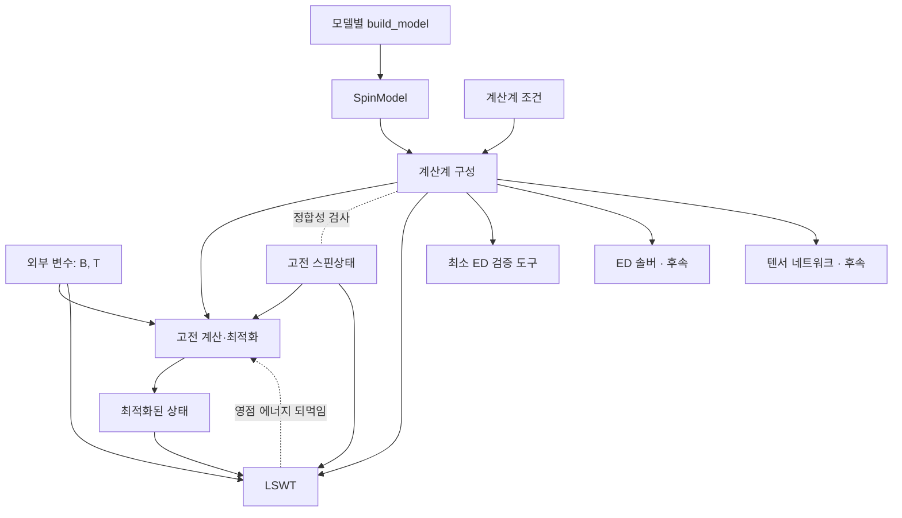

# 모델 간 공통 SpinModel 전달 규약

## Summary

NBCP, 사각격자·삼각격자 하이젠버그 등 모델별 생성 함수가 동일한 자료구조와
동일한 물리적 의미로 정보를 전달하도록 한다. 수신 모듈은 모델 이름으로 분기해
데이터를 해석하지 않고, 공통 필드와 지원하는 항의 종류를 확인한다.

이 문서는 모델·항·상태·계산 요청·결과의 **전달 규약**과 기존 코드와의 대응을
소유한다. 1차 개발 범위, 패키지 배치, 벤치마크, 구현 단계는
[[GOVERNMENT/Working-Pad/idea-proposals/2026-09-29-toolkit-first-development-plan|1차 개발 계획]]이
소유한다. 사용자가 결정한 항목은 아래 결정 목록의 ID로 표시하고, 표시가 없는 세부
필드명과 수치 규약은 검토안이다. 이 문서는 기존 물리 규약을 변경하지 않으며, 이론
정본의 승인 상태와도 별개다.

**구현 상태(2026-09-29, 1단계).** §2–§5의 모델·상태·외부 조건·계산격자 조건과 검증을
`code-space/spintoolkit/`에 구현했다(D16).

| 규약 | 구현 |
|---|---|
| §2 `SpinModel`, `Site`, `Term`, §4 모델 검증, `fingerprint` | `system/model.py` |
| §5 외부 조건(무차원 `field`, `temperature`; D20) | `system/conditions.py`의 `ExternalConditions` |
| §5 계산계 실현(열역학 극한·유한 토러스) | `system/geometry.py`의 `CalculationGeometry` |
| §5 `SpinState`, §4 상태 검증 | `states/spin_state.py` |
| §1 기준 상태 진단 중 정상성(토크) | `methods/classical.py` |
| §1 고전 Hessian(접평면 좌표)과 국소 정밀화(2b) | `methods/classical.py`의 `tangent_expansion`, `refine_classical` |
| §1 영점 에너지 상태 선택(D17, D19; 2b) | `methods/state_selection.py`의 `select_on_manifold` |
| §5 유한 토러스 항 전개(D23; 3단계) | `system/cluster.py`의 `expand_on_torus`, `allowed_momenta`; `classical_energy(..., geometry)` |
| §5 ED 결과 본문, 최소 ED 도구(D10, D23; 3단계) | `methods/ed/`의 `solve_ed`, `EDSector`, `EDResult` |
| §5 공통 결과 머리부·JSON(D14, D24; 4a) | `methods/result.py`의 `ResultHeader`, `save_json`, `load_json` |
| §5 LSWT 결과 본문, 새 모델의 LSWT 진입점(D21, D24; 4a) | `methods/lswt/run.py`의 `solve_lswt`, `LSWTSettings`, `LSWTResult` |
| 영모드 탐색, 무차원 유한 온도 물리량(D25; 4b) | `observables/zero_modes.py`의 `scan_zero_modes`, `observables/thermal.py`의 `thermal_quantities` |
| 구조인자·결합 상관(D26; 4c), 임의 사이트 동시간 상관·사다리 성분(D27) | `observables/structure_factor.py`의 `structure_factor`, `bond_correlations`, `spin_correlation`, `to_ladder` |
| 고전 궤도 위 에너지 지형(D27) | `methods/state_selection.py`의 `orbit_energy_landscape` |
| §6 기존 `SpinSystem`과의 변환(D13 변위 규칙, 2단계) | `system/conversion.py`의 `to_spin_system`, `from_spin_system` |
| NBCP 모델·파라미터 세트·후보 상태(2단계) | `model/nbcp/model.py` |

결과 머리부, JSON 직렬화, 유한 토러스로의 항 전개, Colpa 안정성 진단은 아직 구현하지
않았다. LSWT는 아직 기존 `SpinSystem`을 입력으로 받는다(2단계에서 연결).

모델은 **해밀토니안**이다. 사이트별 스핀 크기, 상호작용 항과 장 결합 방식은
해밀토니안을 이루는 요소로서 모델에 속한다. 모델이 정의하는 것은 무한 주기계에서
항들의 병진 궤도, 즉 해밀토니안의 생성 규칙이다. 유한 클러스터의 연산자는 이
규칙을 계산계 조건에 적용해 얻는 별도 실현이다.

2026-06-04 IR 초안의 local space/site/term 관점을 유지한다. 항은 종류(kind)가
표시된 일반 형식으로 전달하되, 1차 범위에서 허용하는 종류는 **서로 다른 두
사이트의 실수 이선형 교환항과 Zeeman 항**으로 한정한다. 같은 사이트의 이차항,
3·4-스핀 항, 일반 그래프는 후속 확장 항목이다.

## 결정 목록

`docs/development` Beamer의 결정 기록과 같은 ID를 쓴다.

| ID | 내용 | 상태 | 위치 |
|---|---|---|---|
| D01 | 같은 물리 모델을 여러 계산 방법으로 전달하는 workflow | 방향 합의 | §1 |
| D02 | 모델 간 공통 필드와 동일한 의미의 전달 규약 | 방향 합의 | §2 |
| D03 | 모델 작업 공간은 작은 구성으로 시작 | 방향 합의 | 개발 계획 |
| D04 | 원시·중간 계산은 모델 작업 공간, 정돈된 결과는 `data-space/` | 방향 합의 | 개발 계획 |
| D05 | 분율 좌표·정수 셀 이동·단위 모드·항 수 규칙 | 규약 검토 | §3 |
| D06 | 실제 자료형 API(dataclass 생성자·직렬화) | D16으로 결정·구현; 직렬화는 4단계 | §2 |
| D07 | 1차 범위: NBCP와 두 하이젠버그 벤치마크, LSWT 물리량(위상량은 마지막 단계) | 사용자 결정 2026-09-29 | 개발 계획 |
| D08 | `terms[]` 형식: 형식은 열고 1차 검증은 `bilinear`·`zeeman`으로 닫음 | 사용자 결정 2026-09-29 | §2 |
| D09 | 모델은 g-텐서, 장 `B`는 외부 변수; Zeeman 부호 `-mu_B` | 사용자 결정 2026-09-29 | §1, §3 |
| D10 | 최소 ED 검증 도구를 `methods/ed/`에 두고 ED 솔버로 확장 | 사용자 결정 2026-09-29 | 개발 계획 |
| D11 | 패키지 `spintoolkit`, 별칭 `stk`; 키타에프는 후속 벤치마크 | 사용자 결정 2026-09-29 | 개발 계획 |
| D12 | 선택적 Zeeman 항, `g_(alpha beta)` 인덱스, relative 단위 `mu_B = 1`(D20으로 대체), 상태 검증과 기준 상태 진단의 분리 | 사용자 결정 2026-09-29 | §2–§4 |
| D13 | 표준 Fourier 부호와 전체 위치 게이지; NBCP 변위는 `r_target = r_source - d` | 사용자 결정 2026-09-29; 2단계에서 `H(k)` 원소 단위로 수치 확정 | §3, §6 |
| D14 | 상태·계산 요청·결과를 공통·방법별 부분으로 분리; `SpinState`는 정수 초격자 `M` | 사용자 결정 2026-09-29 | §5 |
| D15 | 표준 벤치마크 모델은 `spintoolkit/models/`, 연구 모델은 `model/<name>/` | 사용자 결정 2026-09-29 | 개발 계획 |
| D16 | 1단계 API: `Term.bilinear`·`Term.zeeman` 생성 함수, (사이트, 셀)로 찾는 방향 dict, 위반 일괄 보고, `system/conditions.py`·`system/geometry.py`, 최상위 노출, JSON 직렬화는 4단계·`fingerprint`는 지금 | 사용자 결정 2026-09-29 | §2, §5 |
| D17 | 영점 에너지 상태 선택은 고전 바닥상태 manifold 위에서만: E_cl Hessian 영공간으로 정한 축 `n`의 궤도 `R_n(phi)`에서 E_qm 최소화, 궤도 전체의 E_cl 일정성 검사 | 사용자 결정 2026-09-29 (구현 전) | §1 |
| D18 | D17 구현 계획: `quantum`(E_cl + E_qm 제약 없는 최소화)은 과거의 실수로 보고 D17 구현과 함께 삭제, 그 전까지 호출 시 경고; MAGSWT 격자 탐색은 유지하고 궤도 탐색으로 재현되는지 검증 뒤 재결정; D17은 2단계 뒤 새 자료형 위에 구현; 3단계 삼각격자 벤치마크는 h = 0과 h > h_sat, 여러 차원 영공간 확장은 후속 | 사용자 결정 2026-09-29 | §1, 개발 계획 |
| D19 | D17 판정 기준: 물리 근거 모드(기본)와 고정 상수 모드를 선택; 물리 근거는 수치 정확도 추정·C_cl 대 C_qm·대칭 검사·공선성; 고정 상수의 기본값은 `definitions/defaults.py`, 실행별 값은 방법 설정으로 전달, 판정에 쓴 값은 결과에 기록 | 사용자 결정 2026-09-29 | §1 |
| D20 | 수치 계산은 무차원: 모든 값은 계수의 에너지 단위 E0 기준(`field = mu_B B / E0`, `temperature = k_B T / E0`); 물리 단위는 테슬라·켈빈·meV로 통일해 문서에만 명시하고 변환은 사용자가 함; `Units` 제거, `metadata.energy_unit`은 기록용 라벨; g를 모르면 `g = I`와 Zeeman 에너지 h. 기존 LSWT 모듈은 4단계까지 켈빈·meV 유지 | 사용자 결정 2026-09-29 | §2, §3, §5 |
| D21 | 2단계: NBCP 파라미터 세트는 문헌값(arXiv:2505.06398 Table 1)과 원고값을 두고 g는 세트별(모르면 `g = I`와 Zeeman 에너지); 변환 함수는 `system/conversion.py`; `from_spin_system`은 사이트 장이 모두 같을 때만 변환하고 `local_field` 항은 필요할 때 결정; `LSWTSolver.from_model` 같은 새 진입점은 4단계 | 사용자 결정 2026-09-29 | §6, 개발 계획 |
| D22 | 2b단계(D17 구현): `methods/state_selection.py`의 `select_on_manifold`, `SelectionCriteria`, `SelectionResult`; C_cl과 C_qm이 비슷한 경쟁 영역은 "competition"으로 판정해 고전·양자 최소를 모두 기록하고 자동 선택하지 않음; E_qm은 호출 가능 객체로 받고 기본 제공자는 변환을 거친 기존 `EnergyFunction`(native는 4단계); 2b에서 새 자료형용 DE는 만들지 않고 기존 결과를 `candidate_state`로 변환; `quantum` 경로와 그 전용 BFGS 함수·테스트 삭제 | 사용자 결정 2026-09-29 | §1, 개발 계획 |
| D23 | 3단계: ED는 대칭을 가정하지 않는 일반 해밀토니안이 기본이고 U(1) 자화(n-마그논) 섹터와 병진 운동량 섹터는 선택; 1-마그논 비교는 일반 ED로 하고 별도 도구를 두지 않음; 2-마그논 섹터와 키타에프 flux 섹터·정확해 대조는 후속; 문헌 근사 비교는 4단계; 유한 토러스 항 전개는 `system/cluster.py`에서 한 번 하며 겹친 결합은 합산하고 한 사이트로 접히는 결합은 모든 방법에서 거부(온사이트 이차항 kind 도입 시 재검토); ED 본문은 토러스 전체 에너지를 저장하고 사이트당 값·들뜸 에너지는 메서드로; LSWT 대조는 변환 경유 비공개 도우미로 정규화 없이 | 사용자 결정 2026-09-30 | §4, §5, 개발 계획 |
| D24 | 4단계: `solve_lswt(model, state, conditions, geometry, settings)` 함수를 새 진입점으로 두고 기존 `LSWTSolver`는 유지; 입출력은 무차원; 정규화 기본값은 없음이며 영모드·음의 모드는 오류로 보고(MAGSWT·k-dependent는 명시적 선택, 항상 기록); 대각화 정보(`H(k)`, Colpa 고유값, paraunitary 고유벡터)는 결과에 보관해 같은 계산의 물리량이 재사용하고 JSON에는 머리부와 요약(배열은 요청 시); 4a·4b·4c로 나눠 검증 | 사용자 결정 2026-09-30 | §5, 개발 계획 |
| D25 | 4b: 영모드는 `H(k)`의 최소 고윳값 비 `lambda_min / scale`로 세 구간(수치적 영 <= 1e-12, 후보 <= 1e-6, 갭)으로 판정; 후보가 있으면 유한 온도 물리량은 사용자가 `gapless`를 정할 때까지 멈춤; gapless이면 T > 0의 보손 수·모멘트·자화는 NaN, F·U·S·C는 계산; 탐색점은 자기·원시 격자의 고대칭점과 격자 최소점, 연속 최소화와 선 검사, k = 0의 기원(Goldstone·우연·미상) 표시; 온도는 무차원 `t = k_B T / E0`이고 켈빈 도우미는 두지 않음 | 사용자 결정 2026-09-30 | §5, 개발 계획 |
| D26 | 4c: 구조인자는 한 마그논 가로 성분과 정확한 탄성 Bragg까지(2-마그논 세로 연속체는 후속); 모드별 무게 `W_n^{ab}(q)`를 주 출력으로 하고 넓힌 스펙트럼은 보조; 전체 위치 게이지·사이트당 정규화; 새로 구현하고 기존 `observables/correlations.py`는 비교 대상으로만(유지·삭제는 별도 결정); 결합별 상관과 그 에너지 교차 확인 포함, 일반 실공간 상관은 후속; 영모드인 q는 비탄성 무게 NaN과 표시 | 사용자 결정 2026-09-30 | §5, 개발 계획 |
| D27 | 기존 코드 정리: 검증되지 않은 `observables/correlations.py`를 삭제하고 동시간 실공간 상관(`spin_correlation`)과 사다리 성분(`to_ladder`)을 새 모듈로 옮김(실시간 상관·스펙트럼 함수는 이론 문서의 응답 규약 검토 뒤); MAGSWT 격자 탐색(`opt_method='MAGSWT'`)을 삭제하고 그 목적인 고전 궤도 위 에너지 지형은 `orbit_energy_landscape`로 제공; MAGSWT 정규화(D24)는 유지 | 사용자 결정 2026-09-30 | §1, §6 |

## Proposal

### 1. 전달 경계

| 객체·입력 | 소유하는 정보 | 다른 경계로 전달하는 내용 |
|---|---|---|
| `SpinModel` | 해밀토니안 기본 반복단위, 사이트별 스핀 크기, 항(교환·장 결합의 g-텐서) | 계산 방법에 독립적인 해밀토니안 정의 |
| 계산계 조건 | 열역학 극한 주기계 또는 유한계, 크기·형상·경계조건 | 모델을 적용할 물리적 계산계 |
| 고전 스핀상태 `SpinState` | 사이트별 방향과 자기구조 반복주기 | 고전 에너지 평가·최적화·LSWT의 기준 상태 |
| 계산 요청 | 외부 조건(장 `B`, 온도), 계산계 실현, 목표 물리량 | 해당 계산의 물리 조건 |
| 방법 설정 | 방법 선택, k점 격자·허용오차 등 수치 설정 | 해당 계산을 실행할 조건 |
| 결과 | 방법별 상태·스펙트럼·물리량, 단위·정규화·입력 기록 | 분석·시각화·저장에 필요한 결과 |

**외부 변수의 분류.** 모델 밖에서 바꾸는 입력을 해밀토니안과의 관계에 따라
구분한다(D09).

| 부류 | 예 | H에 들어가는가 | 변경 시 처리 |
|---|---|---|---|
| 해밀토니안 파라미터 | 모델 계수 `J`, `K`, `Gamma` 등 | 예 | 새 모델을 생성 |
| | 외부 장 `B` | 예(모델의 g-텐서와 결합) | 계산 요청에서 변경; 모델 불변 |
| 통계 조건 | 온도 `T` | 아니오(`rho ∝ exp(-H/k_B T)`) | 계산 요청에서 변경 |
| 계산계 실현 | 열역학 극한; 유한 클러스터 크기·형상·경계조건 | 유한 연산자의 힐베르트 공간과 항 집합을 결정 | 계산계를 다시 구성 |
| 수치 설정 | k점 격자, 허용오차, 최적화 초기값·반복 수 | 아니오 | 방법 설정에서 변경 |

LSWT에서 자기 브릴루앙 영역의 `N1 x N2` k점 격자는 `N1 x N2`개의 자기 단위격자로
이루어진 주기 경계 토러스와 같다. 열역학 극한 계산에서는 수렴을 조절하는 수치
설정이지만, 같은 유한 클러스터의 ED 결과와 비교할 때는 계산계 실현을 정한다.
결과에는 어느 의미로 사용했는지 기록한다.

**상태와 계산계의 관계.** 스핀 크기 `S`는 모델에, 방향은 상태에 속한다. 상태는
계산계와 독립적이지 않다.

- 유한 주기 클러스터에서는 자기 초격자가 클러스터를 빈틈없이 채워야 하며, 허용되는
  질서 파수벡터가 클러스터의 이산 k 집합으로 제한된다. 비정합 나선은 정확히
  표현되지 않고, 열린 경계에서는 사이트마다 다른 해가 나올 수 있다.
- 열역학 극한의 LSWT에서는 상태의 자기 단위격자가 계산 셀을 정한다.

따라서 둘의 관계는 한쪽 방향의 입력이 아니라 **정합성 제약**으로 검사한다(§4).
자기 초격자의 주기와 유한 계산계의 크기는 각각 기록한다. TN의 사이트 순서나
LSWT의 국소 회전축은 각 방법의 변환 단계에서 정하며 모델의 사이트 식별자를
덮어쓰지 않는다. LSWT 기준 상태의 정상성과 안정성은 §4의 기준 상태 진단에서 다룬다.

**상태 선택의 되먹임.** `methods/optimization.py`는 고전 에너지만 쓰는 최적화를 제공한다
(`quantum`은 2b에서, MAGSWT 격자 탐색은 D27에서 삭제). 궤도 위 에너지 지형은
`orbit_energy_landscape`로 그린다. 고전 manifold 위의 선택은 `methods/state_selection.py`가 맡는다(D17, D22). 고전
축퇴를 영점 에너지로 가르는 경우 흐름은 "고전 최적화 → LSWT"의 한 방향이 아니다.
결과에는 상태 선택에 사용한 에너지를 기록한다. ED·TN은 고전 기준 상태를 필수로
요구하지 않는다.

**현재 탐색 방법.** 세 경로 모두 differential evolution(DE, `seed=42`)으로 E_cl을
최소화해 고전 해를 얻은 뒤 다음 단계만 다르다. `angle_setting`으로 일부 각도를
고정할 수 있다.

| 경로 | DE 이후 단계 | 한계 |
|---|---|---|
| `classical` | DE 각도에서 E_qm만 계산 | 고전 축퇴를 가르지 않음 |
| `MAGSWT`(D27에서 삭제) | 모든 azimuth에 `k pi/6`(`k = 1..6`)을 더한 점들에서 E_cl + E_qm 비교 | z축 회전만 가정; `tl_angle`의 theta 성분은 회전이 아님; 격자 간격이 분해능 |
| `quantum`(2b에서 삭제) | DE 각도에서 L-BFGS-B로 모든 자유 각도의 E_cl + E_qm 최소화, 교란 재시작 2회 | manifold 제약 없음; 교란이 전역 `np.random` 사용 |

**영점 에너지 상태 선택(D17).** 영점 에너지는 고전 바닥상태 manifold 위에서만
비교한다. manifold 밖의 상태는 토크가 0이 아니어서 보손 선형항이 남고, O(S^2)인
E_cl과 O(S^0)인 E_qm의 합을 자유롭게 최소화하면 manifold에서 O(1/S)만큼 벗어난
해가 나와 LSWT의 차수를 넘는다. 해밀토니안의 정확한 대칭 방향에서는 E_qm도
일정하므로, 선택은 E_cl만 일정한 accidental 방향에서 일어난다(NBCP의 SOC가 있는
3부격자 궤도). 따라서 궤도 축은 해밀토니안의 대칭이 아니라 E_cl에서 정한다.

1. DE 해에서 국소 접평면 좌표로 E_cl의 Hessian을 계산한다. 극점 사이트의 azimuth가
   만드는 가짜 영모드를 피하기 위해 (theta, phi) 좌표를 쓰지 않는다.
2. 전역 회전 생성자 `n x S_a`를 영공간에 사영해 축 `n`을 정한다. 영공간이 없으면 DE
   해를 반환하고, 영방향이 회전 span 밖이면 지원하지 않는 manifold로 경고·기록하며,
   회전 영방향이 여럿이면 축 지정을 요구한다. 사용자는 축을 직접 지정할 수 있다.
3. 궤도 `R_n(phi) S(0)`를 Cartesian 회전으로 만들고, phi 격자 탐색 뒤 1차원 bounded
   최소화로 정밀화한다. phi = 0이 후보에 들어가므로 결과는 항상 정의되고 난수가 없다.
4. 궤도 전체에서 E_cl이 허용오차 안에서 일정한지 검사한다. Hessian 영모드는 2차까지만
   평평함을 보장하기 때문이다. 선택에 쓴 에너지와 곡률 `C_phi`를 결과에 기록한다.

`examples/nbcp_y_orbit_axis_check.py`로 NBCP Y 상태(B = 0.2 T, N = 6)에서 확인했다.
결과는 `docs/development/verification/state-selection-2026-09-29.json`에 있다.

| 경우 | 찾은 축 | 궤도 E_cl 변동 | 궤도 E_qm 변동 |
|---|---|---|---|
| 정확한 U(1) | z, 오차 9e-9 | 7e-18 | 3.8e-16 (선택 없음) |
| J_PD = 0.010 | z, 오차 2e-8 | 1e-17 | 2.83e-6, pi/3 간격의 최소 6개 |
| J_Gamma = 0.010 | z, 오차 1e-8 | 1e-17 | 3.2e-12: 수렴한 선택(아래) |
| J_PD, 문제 전체를 회전 R | `R z`, 오차 8e-9 | 2e-17 | 2.83e-6 (회전 전과 같음) |
| 같은 회전에서 azimuth 이동 `R_z` | — | 1.5e-2 | 의미 없음 |

DE 해(기울기 2–3e-7)에서도 축 오차는 1.3e-5 이하였다. 다만 최소 고윳값이 3.6e-7(다음
고윳값 6.7e-3)이어서 고정 허용오차로는 영모드로 판정되지 않은 경우가 있었다.

**D17 판정 기준 자료(검토안의 근거).** `examples/nbcp_y_orbit_criteria_check.py`의 결과는
`docs/development/verification/state-selection-criteria-2026-09-29.json`에 있다.

- 영공간 판정: DE 세 seed로 축퇴 4경우 12건과 대조 2경우 6건(장을 기울여 고전 축퇴를 푼
  경우, 20 h의 편극 상태)을 비교했다. DE 해에 고정 허용오차(최대 고윳값의 1e-6배)를 쓰면
  12건 중 8건만 판정했다. 간격비 `w_min / w_next < 1e-3`은 12건을 모두 판정했고(최대
  5.3e-5), 고전 L-BFGS-B 정밀화 뒤에는 고정 허용오차도 12건을 모두 판정했다(간격비 최대
  3e-7). 대조군은 어느 규칙에서도 영모드로 판정되지 않았다(간격비 최소 2e-2).
  정밀화는 E_cl을 1.7e-11 이하로 바꾸고 축 오차를 1.4e-5에서 1.1e-7로 줄였다.
- 기울인 장의 대조군 간격비(2e-2)와 축퇴 DE 해의 간격비(5e-5) 사이 여유는 약한 고전
  pinning에서 줄어든다. 판정뿐 아니라 간격비를 결과에 기록해야 한다.
- 편극 상태에서 사라지는 z 생성자의 상대 특이값은 DE 해에서 3–8e-6, 정밀화 뒤 2–4e-8이다.
  생성자 rank의 허용오차는 상태 정확도에 맞춰야 한다(여기서는 1e-4).
- 선택의 mesh 의존성: 궤도 위 E_qm의 6배 조화 성분 진폭은 독립 경로
  (`examples/nbcp_y_angular_matching.py`, N = 96)의 수렴값 lambda_6와 N = 6에서 1.1%
  (J_PD = 0.010), 0.05%(J_Gamma) 이내, N = 12에서 0.2% 이내로 일치했다. 최소 위치는 모든
  경우와 N >= 3에서 phi = 0 (mod pi/3)이었다(차이 7.5e-5 rad 이하).
- 정정: J_Gamma = 0.010의 E_qm 변동 3.2e-12는 수렴한 선택이다(lambda_6 = 1.64e-12).
  24점 격자는 위치 분해능만 제한하며, 조화 성분 fit은 위치를 정한다.

**D17 판정 기준(D19).** 위 수치는 NBCP Y 상태 하나에서 얻은 것이므로 고정 임계값은 모델에
따라 달라질 수 있다. 각 판정을 그것이 답하는 물리적 질문에 묶고, 두 모드를 둔다.

| 판정 | 물리적 질문 | 물리 근거 모드(기본) | 고정 상수 모드 |
|---|---|---|---|
| 영공간 | 이 방향은 정말 평평한가 | DE 뒤 고전 국소 정밀화. 정밀화 뒤 최대 토크로 추정한 수치 정확도 이하의 곡률은 평평함; 분해되는 작은 곡률은 궤도 방향의 고전 곡률 C_cl과 양자 선택 곡률 C_qm을 비교해 "고전 고정", "양자 선택", "경쟁"으로 기록 | 간격비 `w_min / w_next < 1e-3` |
| 선택 없음 | E_qm이 궤도 위에서 변하지 않아야 하는가 | 궤도 회전이 모든 항의 대칭인지(`R_n^T J R_n = J`, zeeman은 `B ∥ n`과 `g` 불변) 모델에서 판정: 대칭이면 "선택 없음(대칭)"; 대칭이 아닌데 조화 성분 진폭이 fit 잔차 수준이면 "분해 불가" | 진폭이 fit 잔차의 10배와 `1e3 eps abs(E_qm)` 중 큰 값보다 작으면 "선택 없음" |
| 생성자 rank | 이 회전이 상태를 움직이는가 | `n x S_a`가 모든 사이트에서 0 ⇔ 모든 스핀이 `n`과 공선. 허용오차는 정밀화 뒤 추정한 각도 정확도의 배수 | 상대 특이값 `1e-4` |

- 세 물리 근거는 모두 가벼운 계산이다. 수치 정확도는 토크, C_cl은 Hessian, C_qm은 궤도
  탐색에서 이미 계산하는 E_qm 값, 대칭은 항별 행렬 연산, 공선성은 벡터 외적으로 얻는다.
- 고정 상수의 기본값은 기존 관례대로 `definitions/defaults.py`에 이름 있는 상수로 두고,
  함수 기본값은 그 상수를 참조한다. 실행별 값은 계산 요청의 방법 설정(§5)으로 전달한다.
- 어느 모드든 간격비, C_cl, C_qm, 진폭과 fit 잔차, mesh `N`, 사용한 임계값을 결과에 기록한다.
- 물리 근거 모드의 세부 계수(수치 정확도 추정의 배수 등)는 구현 시 정하고 이 자료로 검증한다.

**`quantum` 경로를 없애는 이유(D18).** 표준 스핀파 전개 `H = S^2 e_cl + H_1 + H_2 + ...`는 기준
배열이 고전 정상점이어서 보손 선형항 `H_1`이 사라진다는 전제 위에 선다. E_cl + E_qm을 제약
없이 최소화한 배열은 고전 해에서 O(1/S) 벗어나므로 `H_1 = O(S^{1/2})`가 남는데, E_qm은 이
항을 버린 조화 영점 에너지다. 그 에너지 이득 O(S^0)는 LSWT가 버린 cubic·quartic 보정과 같은
차수이고, 조화 근사 에너지는 변분 상한도 아니다. 선택 에너지가 작은 NBCP(2.8e-6, 1.6e-12)에서는
후보별 O(S^0) 이완 차이가 선택을 뒤집을 수 있다. 따라서 이 배열은 LSWT 기준 상태도, 바닥상태도
아니다. 정당한 두 부분은 manifold 위의 선택(D17)과, 기준점을 옮기지 않고 계산하는 모멘트 방향의
1/S 보정(필요 시 별도 관측량)이다. `quantum` 경로는 2b 구현과 함께 삭제했고, 이 이름을
요청하면 `select_on_manifold`를 안내하는 `ValueError`를 낸다.

**D17 구현(2b, D22).** `select_on_manifold(model, state, conditions, quantum_energy, axis=None,
criteria=SelectionCriteria())`는 다음 순서로 판정하고 `SelectionResult`(판정, 상태, 축, phi,
후보 상태, 진단, 기준)를 돌려준다. 수치 검증 기록은
`docs/development/verification/state-selection-stage2b-2026-09-29.json`, 스크립트는
`examples/nbcp_state_selection_check.py`다.

1. 고전 정밀화(`refine_classical`): 접평면 좌표에서 해석적 기울기로 L-BFGS-B를 돌린 뒤,
   평평한 방향을 뺀 Newton 단계로 마무리한다. 영방향의 위치는 건드리지 않는다.
2. 해석적 Hessian(`tangent_expansion`): 스핀 i를 `n_i sqrt(1 - x_i . x_i) + x_i^a e_i^a`로 움직이면
   `d2E/dx_ia dx_jb = S_i S_j e_ia . K_ij e_jb + delta_ij delta_ab S_i n_i . h_i`
   (`K_ij`는 교환 행렬, `h_i = -dE/dS_i`)이다. 중앙 차분과 7.8e-10(차분 오차 수준) 안에서 일치했다.
3. 회전 생성자 `e_k x n_i`의 SVD로 rank를 정하고, 생성자 span에 제한한 Hessian의 고유벡터에서
   축을 얻는다. 평평한 방향이 회전 span보다 많으면 `unsupported_manifold`, 평평한 회전이
   여럿이면 `axis_required`다.
4. 궤도 36점에서 E_cl과 E_qm을 계산하고 12차까지 Fourier 최소제곱 fit을 한다. 최소 위치는
   fit 급수의 조밀 격자와 1차원 bounded 최소화로 정한다. fit이 위치를 정하므로 1e-12 규모의
   변동도 표본 간격보다 정밀하게 찾는다.

판정 값은 `no_degeneracy`, `selected`, `no_selection`, `unresolved`, `competition`, `not_flat`,
`unsupported_manifold`, `axis_required`다. 물리 근거 모드의 계수는 구현하면서 다음과 같이
정했다(D19가 구현 시 정하도록 남긴 부분, 사용자 검토 대기).

| 항목 | 물리 근거 모드 | 기본값 |
|---|---|---|
| 상태 정확도 `delta` | 평평하지 않은 Hessian 방향에 남은 Newton 보정의 최대 성분 | — |
| 곡률 하한 | `accuracy_factor * max(abs(w)) * (delta + roundoff_factor * eps)` | 10, 1e3 |
| 생성자 rank·대칭 허용오차 | `accuracy_factor * (delta + roundoff_factor * eps)` | 같음 |
| 해상 기준 | 조화 성분 최대 진폭 > `max(residual_factor * fit 잔차, roundoff_factor * eps * max(abs(E_qm)))` | 10, 1e3 |
| 고전·양자 비교 | Hessian이 평평하면 궤도 E_cl 변동 / E_qm 변동, 아니면 `C_cl / C_qm`; `[0.1, 10]`이면 경쟁 | (0.1, 10) |
| 고전 고정 선별 | Hessian이 평평하지 않은 방향은 궤도 한 칸에서 고전 에너지 변화가 E_qm 변화의 10배를 넘으면 E_qm 궤도 계산 없이 `no_degeneracy` | 대역 상한 |

NBCP 확인(Y 0.2 T, V 1.4 T, J_PD 또는 J_Gamma = 0.010 meV, 기준 상태에서 1e-3 rad 떨어진 출발,
기준은 `data-space/verification/260912-pseudo-goldstone`의 N = 48 스캔):

| 상태·결합 | 판정(두 모드, N = 6, 12) | 조화 | 진폭 / 기준 | C_qm / 기준 | 해상 여유 |
|---|---|---|---|---|---|
| Y, J_PD | selected | 6 | 1.011, 1.002 | 1.009, 1.002 | 3e4 이상 |
| Y, J_Gamma | selected | 6 | 1.000 (1.643e-12) | 1.000 | 9.0e2 |
| V, J_PD | selected | 6 | 1.006, 1.001 | 1.005, 1.000 | 1.6e3 이상 |
| V, J_Gamma | selected | 3 | 1.000 | 1.000 | 3.6e8 이상 |

- 정밀화 뒤 토크는 1e-17, 영 고윳값은 1e-18(다음 고윳값 4.8e-3–6.7e-3), 축 오차는 1e-15
  이하였다. 유한차분 시제품의 축 오차는 1e-8이었다.
- Y의 J_Gamma 변동(진폭 1.64e-12, fit 잔차 1.1e-16)은 해상 기준(1.8e-15)의 약 900배로 분해된다.
  최소 위치는 기준과 5.3e-6 rad 이내다. 이 차이는 fit의 위치 분해능(잔차 / (m A) ≈ 1e-5)과 같은
  규모이며, 기준 스캔의 최소도 정확한 대칭점에서 4.8e-7 떨어져 있다. 다른 경우는 6e-7 이내다.
- MAGSWT 정규화 값은 모든 궤도 점에서 하한 1e-9에 머물렀다(보정할 음의 고윳값이 없음).
- DE 출발(세 seed) 36회: 정확한 U(1)는 `no_selection`, J_PD·J_Gamma·회전한 J_PD는 `selected`,
  편극 20 h는 `no_degeneracy`로 두 모드가 같았다. 장을 기울인 대조군 `(0.3h, 0, h)`는 고정
  상수 모드에서 `no_degeneracy`(간격비 2e-2), 물리 근거 모드에서 `competition`
  (`C_cl / C_qm = 0.46`)이다. 고전 최소는 유일하지만 고정 곡률이 영점 선택 곡률과 비슷하다는
  뜻이며, 이 판정의 해석은 사용자 검토 항목이다.
- 벤치마크: 삼각격자 120도(h = 0)는 `axis_required`(평평한 회전 3개), z축을 주면 `no_selection`
  이다. 정사각격자 편극(h = 5 > h_sat = 4)은 생성자 rank 2로 `no_degeneracy`, 장 방향 축을 주면
  "상태가 회전에 불변"인 `no_selection`이다.
- MAGSWT 재현(D18): 출발 azimuth가 `k pi/6` 격자 위(0)이면 네 경우 모두 같은 총에너지
  (차이 4.7e-16 이하)다. 격자 밖(0.3 rad)이면 궤도 탐색이 1.3e-12(Y, J_Gamma)–8.1e-6 meV
  (V, J_PD) 낮다. 이 결과로 MAGSWT 격자 탐색은 삭제했다(D27).



### 2. 공통 필드와 형태

Python의 명시적 자료형으로 표현한다. 아래 표는 필드의 의미를 정하는 것이며
아직 dataclass 생성자나 직렬화 API를 확정하지 않는다(D06).

| 경로 | 필수 여부·형태 | 의미 |
|---|---|---|
| `schema_version` | 필수, 정수 | 이 전달 규약의 버전. 최초 제안은 1 |
| `lattice.vectors` | 필수, 실수 `(2, 2)` | 각 행이 기본 격자벡터인 행렬 `A` |
| `sites` | 필수, 비어 있지 않은 레코드 목록 | 해밀토니안 기본 반복단위의 사이트 |
| `sites[].id` | 필수, 유일한 문자열 | 모델 내 안정된 사이트 식별자 |
| `sites[].position` | 필수, 실수 `(2,)` | `A` 기준 분율 좌표 `f`; Cartesian 위치는 `r = f @ A` |
| `sites[].spin` | 필수, 양의 정수·반정수 | 무차원 스핀 양자수 `S`; 국소 차원은 `2S+1`로 유도 |
| `terms` | 필수, 목록 | 각 병진 궤도에서 한 번 기록한 해밀토니안 항 |
| `terms[].kind` | 필수, 문자열 | 항의 종류. 1차 허용값은 `bilinear`, `zeeman` |
| `terms[].participants` | 필수, `(site_id, cell_offset)` 목록 | 항에 참여하는 사이트와 정수 셀 좌표 `(2,)`. 길이는 kind가 정함 |
| `terms[].coefficient` | 필수, 실수 배열 | kind별 계수. 형태는 아래 표 |
| `terms[].label` | 선택, 문자열 | NN·NNN 또는 x·y·z 등 의미 라벨. 수신 모듈은 이것으로 계수를 재구성하지 않음 |
| `metadata.model_id` | 필수, 문자열 | 모델 식별·출처 추적용. 솔버 분기용이 아님 |
| `metadata.parameters` | 매핑, 생략 시 빈 매핑 | 적용한 모델별 입력 파라미터의 값·단위 |
| `metadata.sources` | 목록, 생략 시 빈 목록 | 파라미터·모델 출처 |
| `metadata.energy_unit` | 선택, 문자열 | 계수의 에너지 단위 E0의 이름(예: `"meV"`). 기록용 라벨이며 계산에 쓰지 않음(D20) |

**1차에서 허용하는 항의 종류(D08).**

| kind | 참여자 수 | `coefficient` | 해밀토니안 기여 |
|---|---|---|---|
| `bilinear` | 2, 서로 다른 물리 사이트 | 실수 `(3, 3)` 행렬 `J` | `S_(R+n1,a)^T J S_(R+n2,b)` |
| `zeeman` | 1, `cell_offset = (0, 0)`; 사이트당 최대 하나 | 실수 `(3, 3)` 무차원 g-텐서 `g_a` | `-b^T g_a S_(R,a)`, `b`는 무차원 장 |

`zeeman` 항은 계수가 고정된 항이 아니다. 모델은 장 결합 방식인 `g_a`만 담고,
장 `B`는 계산 요청에서 받는다(D09). `zeeman` 항은 선택 사항이다(D12). 항이 없는
사이트는 장과 결합하지 않는다는 뜻이며, 이는 규약으로 정한 의미이지 묵시적 기본값이
아니다. 계산 요청의 `B`가 0이 아닌데 `zeeman` 항이 없는 사이트가 있으면 수신 모듈은
경고하고 결과에 기록한다. `B = 0`인 계산에는 영향이 없다. 영행렬 항을 강제하지 않는
이유는 모델 작성 부담을 줄이기 위해서다. 영행렬 항의 계산 비용은 대각화에 비해
무시할 수 있다.

**형식은 열고 검증은 닫는다(D08).** 이 형식은 후속 kind(같은 사이트 이차항, 3·4-스핀
항 등)를 스키마 변경 없이 담을 수 있도록 연다. 그러나 1차 공통 검증은 허용 목록
밖의 kind를 명시적으로 거부하고, 각 수신 모듈은 자신이 지원하는 kind를 선언한다.
지원하지 않는 kind를 조용히 무시하지 않는다. 후속 kind의 계수 형태와 의미는 해당
kind를 도입할 때 정의한다. 같은 사이트가 반복되는 항은 `S`에 따라 의미가 달라지므로
(예: `S=1/2`에서 `(S^z)^2 = 1/4`) 별도 규약 없이 허용하지 않는다.

같은 물리 정보의 계산용 원본은 한 곳에 둔다. `coefficient`는 이미 평가된 수치이며
솔버가 `metadata.parameters`를 읽어 다시 계산하지 않는다. 함수 객체, 미평가 문자열
수식, 모델별 config 객체를 필수 계산 필드로 넘기지 않는다.

### 3. 좌표·스핀·단위·항 규약

**좌표(D05).** 기본 반복단위의 사이트 `a`와 셀 정수 좌표 `R`로 물리 사이트를
식별한다. 위치는 `(R + f_a) @ A`이다. 이선형 항 `(a, n1) - (b, n2)`의 실제 공간
변위는 `delta = (n2 - n1 + f_b - f_a) @ A`로 유도한다. 모델 입력에는
`cell_offset`을 보관하고 독립적인 `displacement` 값을 중복 저장하지 않는다.
분율 좌표의 자동 감싸기는 결합 셀 좌표까지 바꿀 수 있으므로 묵시적으로 수행하지
않는다.

**스핀축.** 모든 계수는 모델 전체에서 하나의 전역 Cartesian 스핀 성분
`(Sx, Sy, Sz)`를 사용한다. 스핀 연산자 정규화는 `S` 연산자 기준이며 Pauli
행렬 계수를 그대로 넣지 않는다. 원자료의 국소축이나 Pauli 규약에서 변환했다면
모델 생성 단계에서 변환하고 그 기준을 출처에 기록한다. 위치 공간 2차원과
스핀 공간 3차원을 구분한다. 구체적인 원자료 축 변환은 해당 모델에서 검토한다.

**Fourier 부호와 위치 게이지(D13).** 툴킷은 고체물리의 표준 부호와 전체 위치
게이지를 사용한다.

```text
a_(i mu) = N_uc^(-1/2) sum_k exp(+i k . r_(i mu)) a_(k mu),   r_(i mu) = R_i + tau_mu
```

source `a`, target `b`인 항의 호핑·이상 항 위상은 `exp(+i k . Delta)`이며
`Delta = r_target - r_source`이다. 부호를 반대로 택해도 `k`와 `-k`가 바뀔 뿐
스펙트럼 집합과 Chern 수는 같다. 위치 게이지는 선택에 따라 결과가 달라진다. 셀
위치 `R`만 쓰는 격자 게이지와 전체 위치 게이지는 에너지와 Chern 수가 같지만 국소
Berry 곡률이 다를 수 있다. thermal Hall 전도도는 밴드 에너지 가중치를 곱해
Berry 곡률을 적분하므로 국소 값의 영향을 받는다. 위치 정보를 포함하는 전체 위치
게이지를 쓴다. 이 식은 `docs/lswt` 운동량 공간 문서의 식과 같다. 다만 이 결정은
툴킷 규약에 한정하며, 이론 정본 notation 문서의 "Not Yet Fixed" 상태를 바꾸지 않는다.

**항의 의미.** 1차 범위의 해밀토니안은 다음과 같다.

```text
H = sum_R sum_(bilinear) S_(R+n1,a)^T J S_(R+n2,b)
    - sum_R sum_a b^T g_a S_(R,a),        b = mu_B B / E0
```

이는 인터페이스 규약이며 새 이론 claim이나 실제 물질 모델의 정당성을 승인하는
수식이 아니다.

**Zeeman 부호와 성분(D09, D12).** 부호는 음(`-mu_B B^T g S`)이다. 스핀이 장 방향으로
정렬하는 자성 문헌의 관례이며, 현재 고전 에너지 코드의 `-h . S`와 부호가 같다.
기존 코드의 사이트별 장 계수와는 `h_a = mu_B g_a^T B`로 대응하며, 기존 NBCP 예제의
`h = g_z mu_B B`와도 부호가 같다. 성분 규약은 `g_(alpha beta)`가 스핀 성분 `beta`를
장 성분 `alpha`에 연결하는 것이다. Einstein 합 규약으로
`H_Z = -mu_B B_alpha g_(alpha beta) S_beta`이다. 코드에서는 무차원 장 `b = mu_B B / E0`를
쓴다(D20).

**단위(D20).** 수치 계산은 무차원이다. 모든 계수, 에너지, 장과 온도는 계수의 에너지
단위 E0로 표현한다. J를 meV로 넣었으면 E0 = meV이고, `J = 1`로 넣었으면 E0 = J다.
길이는 격자 행렬 `A`의 단위를 그대로 쓴다.

| 양 | 코드 안의 값 | 물리 단위로의 변환(사용자) |
|---|---|---|
| 장 | `field = mu_B B / E0` | `B[T] = field * E0[meV] / mu_B` |
| 온도 | `temperature = k_B T / E0` | `T[K] = temperature * E0[meV] / k_B` |
| 에너지 결과 | E0 단위 | E0를 곱함 |

물리 단위는 장 테슬라, 온도 켈빈, 에너지 meV로 통일해 문서에만 명시한다.
`mu_B = 5.7883818060e-2 meV/T`, `k_B = 8.617333262e-2 meV/K`는 사용자의 변환을 위해
`definitions/constants.py`에 둔다. g를 모르면 모델의 `zeeman` 항을 `g = I`로 두고
`field`에 Zeeman 에너지 `h / E0`를 넣는다. `metadata.energy_unit`은 E0의 이름을 적는
기록용 라벨이다. 기존 LSWT 모듈(`methods/lswt`, `observables`)은 4단계에서 새 자료형을
직접 읽게 될 때까지 켈빈과 meV를 유지하며, 변환 다리(`system/conversion.py`)가 그
경계에서만 환산한다.

**항 수와 중복(D05).** 각 항의 병진 궤도를 한 번 기록하고 위 식에 `1/2`를
추가하지 않는다. 전체 참여자의 셀 좌표를 같은 정수만큼 옮긴 레코드는 같은 항이다.
참여자 순서를 바꾼 레코드는 계수의 대응 인덱스를 바꾼 것과 같은 항이다. 이선형
항에서는 `(a, b, n, J)`와 `(b, a, -n, J.T)`가 같은 항이다. 공통 검증은 이런 중복을
확인한다. 같은 결합의 Heisenberg·Kitaev·DM 기여는 생성 단계에서 행렬로 합쳐 한
레코드로 전달한다. `J`에 대칭성을 강제하지 않는다. `a == b`이면서 셀 좌표가 다른
이선형 항은 허용한다. 같은 물리 사이트의 이차항은 별도의 연산자·상수 규약이
필요하므로 1차 범위에서 명시적으로 거부한다.

유한 주기계로 전개할 때는 서로 다른 병진 항이 같은 사이트 쌍으로 접힐 수 있다.
원래 항의 중복도를 보존해야 하며, 단순히 사이트 쌍을 set으로 만들면 안 된다.
전개 결과 자기 자신에 작용하는 항이 생기면 지원 여부를 확인하고 명시적으로 처리한다.

### 4. 생성과 검증 책임

```python
# Proposed interface, not implemented.
model = nbcp.build_model(parameters)
validate_spin_model(model)
```

모델별 생성 함수는 입력 파라미터를 해석하고 공통 표현으로 변환한다. 공통
검증은 모델 이름에 관계없이 동일하게 실행한다. 소비자는 검증된 계수와 연결정보를
사용하고, 지원하지 않는 항·기하·단위 변환을 명확히 거부한다.

| 모델 검증 | 조건 |
|---|---|
| 형태·유한성 | 벡터·행렬 shape 일치, 실수이며 NaN·Inf 없음 |
| 격자 | 서로 독립인 두 벡터; 퇴화 판정은 명시된 수치 허용오차 사용 |
| 사이트 | ID 유일, `S > 0`, `2S`가 정수; 각도나 상태의 길이로 사이트 수를 추정하지 않음 |
| 항의 종류 | kind가 1차 허용 목록에 있음; 참여자 수와 계수 shape가 kind와 일치 |
| 연결 | 모든 참여자 endpoint 존재, 셀 좌표가 정확한 정수; 실수를 묵시적으로 반올림하지 않음 |
| 이선형 항 | 병진·순서 교환 중복 검사, 같은 물리 사이트 반복 거부, 비대칭 실수 J 허용 |
| Zeeman 항 | 선택 사항; 사이트당 최대 하나; 셀 좌표 `(0, 0)` |
| 단위 | 선언한 공통 단위와 scale 제약 충족; 알 수 없는 환산계수는 추정하지 않음 |
| 독립성 | 모델 생성이 RNG·솔버 실행·파일 저장을 호출하지 않음 |
| 소유권 | 입력 배열을 복사해 보관; 반환한 모델의 배열을 소비자가 변경하지 못하게 보호 |
| 반복성 | 같은 평가된 입력에서 같은 모델 계수·연결 순서; 다른 기준상태를 선택해도 불변 |

상태는 모델과 별도로 검증한다. 상태와 계산계만으로 판정하는 **상태 검증**과,
모델과 외부 장 `B`가 있어야 판정하는 **기준 상태 진단**을 구분한다(D12).

| 상태 검증 | 조건 |
|---|---|
| 사이트 대응 | 자기 단위격자의 모든 사이트에 방향이 있고, 모델에 없는 사이트가 없음 |
| 방향 | 유한한 단위 벡터 |
| 자기 초격자 | 기본 격자에 대한 정수 행렬이며 행렬식이 0이 아님 |
| 계산계 정합 | 자기 초격자가 유한 계산계를 빈틈없이 채움 |
| 주기 최소성 | 선언한 초격자보다 작은 주기로 설명되면 알림(오류 아님). 밴드가 접혀 겹치면 밴드별 Chern 수가 모호해진다 |

| 기준 상태 진단 | 조건 |
|---|---|
| 정상성 | 주어진 모델·`B`에서 사이트별 토크 크기를 계산해 결과에 기록; 허용오차를 넘으면 경고 |
| 안정성 | LSWT에서 Colpa 조건(BdG 행렬의 양정치 여부)으로 국소 극소를 판정해 결과에 기록 |

LSWT의 기준 상태는 각 스핀이 국소장과 평행하여 토크가 0인 고전 정상점이어야 보손
선형항이 사라진다. 국소 극소가 아니면 허수 진동수가 나타난다. 기존 `MAGSWT` 경로는
불안정한 기준 상태를 화학 퍼텐셜로 정규화해 다루므로, 정상성 위반은 계산을 막는
오류가 아니라 결과에 기록하는 경고로 둔다. Goldstone 모드처럼 Colpa 조건이
경계에서 성립하는 경우는 상태의 문제가 아니라 LSWT의 영모드 처리 문제이며, 기존
구현 backlog에서 다룬다.

객체의 필드를 동결하는 것만으로 NumPy 배열 내용까지 불변이 되지는 않는다.
구현 시 복사와 배열 변경 보호를 함께 검증한다. 모델 계수의 변경은 새 모델을
만드는 방식으로 처리하고, 기존 계산에 전달한 모델을 제자리 수정하지 않는다.
외부 장 `B`의 변경은 모델을 바꾸지 않는다.

### 5. 상태·계산 요청·결과

세 객체를 모든 방법에 공통인 부분과 방법별 부분으로 나눈다(D14). 1차에서는 공통
계산 요청, 공통 결과 머리부, 고전 계산·LSWT용 `SpinState`, LSWT 결과 본문을
정한다. 최소 ED 검증 도구도 공통 요청과 공통 머리부를 사용한다. ED 결과 본문은
3단계에서 정했고(D23), TN 관련 부분은 TN 도입 시 정한다. 공통 머리부와 JSON 직렬화는
4a에서 구현했다(D24).

| 객체 | 모든 방법 공통 | 방법별 |
|---|---|---|
| 상태 | — | 고전 스핀 배열 `SpinState`는 고전 계산과 LSWT 전용. ED·TN의 상태는 양자 상태로 별도 객체 |
| 계산 요청 | 외부 조건(`B`, `T`), 계산계 실현, 목표 물리량 | 방법 설정: LSWT의 k점 격자·regularization, ED의 대칭 섹터, TN의 bond dimension |
| 결과 | 머리부: 입력 출처, 단위·정규화, 진단 | 본문: LSWT의 밴드·영점 에너지, ED의 섹터별 고유값, TN의 수렴 정보 |

**`SpinState`.** 세부 필드명은 검토안이다.

| 필드 | 형태 | 의미 |
|---|---|---|
| `schema_version` | 정수 | 상태 규약의 버전 |
| `model_ref` | 모델의 `fingerprint` | 이 상태가 대응하는 모델 |
| `supercell` | 정수 `(2, 2)` 행렬 `M`, `det M != 0` | 자기 격자벡터의 행 = `M @ A` |
| `directions` | `(site_id, cell) → vector` 매핑(D16) | 각 사이트마다 `abs(det M)`개; `cell`은 초격자의 대표 셀 좌표; `vector`는 단위 벡터 |
| `provenance` | 기원과 선택 에너지 | 초기값·최적화·직접 지정; 선택에 쓴 에너지(고전, quantum, MAGSWT) |

방향은 단위 벡터로 저장한다(D12). 각도 표현은 극점(`theta = 0`)에서 `phi`가
정의되지 않으므로 저장 형식으로 쓰지 않는다. LSWT의 국소 좌표축은 방법의 변환
단계에서 정한다. 대표 셀은 `cell @ inv(M)`가 `[0, 1)^2`에 놓이는 정수 좌표이며,
`adj(M)`을 쓰는 정수 연산으로 부동소수점 오차 없이 계산한다.

현재 `CommensurateStructure`는 대각 초격자 `(n1, n2)`만 표현하므로 √3×√3 셀을
담지 못한다. 정수 행렬을 쓰면 NBCP의 기본 삼각격자
`A = [[1/2, √3/2], [1/2, -√3/2]]` 하나로 네 후보 셀을 모두 표현한다.

| 후보 셀 | `M` | `abs(det M)` |
|---|---|---|
| One MSL | `[[1, 0], [0, 1]]` | 1 |
| Two MSL | `[[1, 1], [1, -1]]` | 2 |
| Three MSL | `[[2, 1], [1, 2]]` | 3 |
| Four MSL | `[[2, 0], [0, 2]]` | 4 |

**계산 요청(공통).**

| 부분 | 내용 |
|---|---|
| 외부 조건 | 무차원 장 `field = mu_B B / E0`와 온도 `temperature = k_B T / E0`(D20) |
| 계산계 실현 | `thermodynamic_limit` 또는 `finite_torus`. 유한 토러스는 정수 클러스터 행렬 `L`로 주고, `L @ inv(M)`가 정수여야 한다. 원통·열린 클러스터는 TN·ED 솔버 도입 시 추가 |
| 목표 물리량 | 스펙트럼, 바닥상태 에너지, 열역학량, 상관함수, 위상량 중 요청한 항목 |
| 방법 설정 | 방법별. LSWT(D24): 열역학 극한에서의 k점 격자 `(N1, N2)`(기본 24 x 24, Γ를 피하는 반 칸 이동), 명시적 k점, regularization(기본 없음; MAGSWT·k-dependent), 정상성·영모드 허용오차 |

유한 토러스에서는 클러스터가 허용 k점을 정하므로 별도 k점 격자를 받지 않는다.
열역학 극한에서 k점 격자는 수렴을 조절하는 수치 설정이다.

**유한 토러스 전개(D23).** `expand_on_torus(model, geometry)`가 모든 항을 모든 셀로
옮겨 토러스에 접는다. 규칙은 모든 방법(고전 에너지, ED, 토러스 운동량의 LSWT 비교)에 같다.

- 작은 토러스에서 서로 다른 셀의 항이 같은 사이트 쌍을 만들면(예: 2 x 2 정사각 토러스의
  +x·-x 이웃) 모두 남겨 합산한다. 이것이 주기 클러스터의 해밀토니안이고, 열역학 극한의
  `H(k)`를 토러스 운동량에서 계산하면 같은 합산이 들어간다.
- 결합의 양 끝이 한 사이트로 접히면 `S_i . J . S_i`인 온사이트 항이 된다. 고전 스핀, 스핀
  연산자, LSWT에서 `bilinear` kind로 일관되게 다룰 수 없으므로 모든 방법에서 거부한다.
  같은 사이트 이차항 kind를 도입할 때 세 방법의 규칙을 함께 정해 다시 연다.
- 토러스 운동량은 `L q`가 정수인 `k = 2 pi inv(A) q`다. ED의 운동량 블록은
  `T_R |psi> = exp(-i k . R) |psi>`인 상태를 모으며, 이는 §3 규약의 `a_k^dagger |0>`가 운동량
  `+k`를 갖는 부호다. DM 항이 있는 1-마그논 비교가 이 부호를 확인한다(3단계 기록).

**결과.** 공통 머리부와 방법별 본문으로 나눈다.

| 부분 | 내용 |
|---|---|
| 머리부 | `schema_version`, 방법, 입력 출처(모델·상태 해시, 계산계 실현, 외부 조건, 방법 설정, 코드·상수 버전), 에너지 단위, 정규화(LSWT 에너지는 사이트당, ED 본문은 토러스 전체 에너지; D23), 진단(정상성 토크, Colpa 안정성, Zeeman 누락 경고, 적용한 regularization, k점 격자의 의미) |
| LSWT 본문(D24) | k점(Cartesian, 자기 역격자 분율)과 가중치, 대각화한 `H(k)`, Colpa 고유값, paraunitary 고유벡터, 정규화 이동량, 선형항 크기, `E_cl`, `Delta E_zp`, `E_GS`(사이트당), 부격자별 `<n>`과 모멘트 `S - <n>`, 요청한 물리량. 대각화 정보는 같은 계산 안의 물리량이 재사용하며, JSON에는 요약만 쓰고 배열은 요청 시 |
| ED 본문(D23) | 방법 `ed`, 섹터(양자화 축, 마그논 수, 운동량 사용 여부), 블록별 운동량(분율 `q`, Cartesian `k`)·차원·고유값(토러스 **전체** 에너지)·풀이 방법·잔차, 선택적 고유벡터, 축 방향 편극 상태의 기준 에너지, 진단(섹터를 바꾸는 계수, Hermite성). 사이트당 값과 들뜸 에너지(`E - E_ref`)는 메서드로 계산 |

이 구조는 기존 `SolverResult`(`ground_state_energy`, `eigenvalues`, `spin_config`,
`data`)를 확장한다. 구현 backlog의 "k-data dict를 dataclass로 전환" 항목은 LSWT
본문 설계에 포함한다.

### 6. 기존 코드와의 연결

아래는 현재 구현의 관찰 결과이며 새 규약으로의 변환 완료를 뜻하지 않는다. 경로는
`code-space/spintoolkit/` 기준이다(0단계 이름 변경 후).

| 현재 코드 | 관찰 | 이행 시 요구 |
|---|---|---|
| `system/spin_system.py` | 사이트에 각도가 필수이고 position은 Cartesian; `Coupling` 설명을 D13에 맞게 고침(2단계) | `system/conversion.py`로 공통 모델·상태와 양방향 변환 |
| `system/lattice/base.py` | basis position을 분율 좌표로 설명함 | 현재 NBCP Cartesian 위치와의 변환을 명시 |
| `methods/lswt/energy.py` | J 항을 각 레코드마다 더하고 사이트별 장 계수 h 항을 뺌 | 중복계수·에너지 정규화의 회귀 검증; `h_a = mu_B g_a^T B` 변환 |
| `methods/lswt/hamiltonian.py` | 저장된 displacement로 Fourier 위상을 직접 계산함 | 변위 해석(아래)과 Fourier 위상·basis 변환을 함께 검증 |
| `methods/optimization.py` | classical 최적화 경로 제공; MAGSWT 격자 탐색은 D27에서 삭제. `angle_setting=None` 결함은 `8f4dd1e`에서 수정; `quantum`과 전용 BFGS 함수는 2b에서 삭제(D18, D22), 알 수 없는 이름은 `ValueError` | 상태 선택에 사용한 에너지를 결과에 기록; MAGSWT 처리는 재현 확인(2b) 뒤 사용자 결정 |
| `model/nbcp/unit_cells.py` | 후보 자기단위격자와 결합·상태를 함께 생성, 각도 생략 시 난수 사용 | `model/nbcp/model.py`가 모델(`build_model`)과 상태(`candidate_state`)를 분리해 제공; 기존 함수는 유지 |

**NBCP 결합 변위의 해석(D13).** `SpinSystem.Coupling` 설명은 displacement를
source→target이라고 적는다. 두 해석을 네 후보 셀에서 검사했다.
`examples/nbcp_y_soc_conditions.py::geometry_audit`도 Three MSL의 차이를 명시한다.

| 후보 셀 | 최대 정수 셀 잔차 `+d` / `-d` (2026-09-23) | 물리 결합 포함 `r_t = r_s - d` (2026-09-29) | 물리 결합 포함 `r_t = r_s + d` (2026-09-29) |
|---|---|---|---|
| One MSL | 1.11e-16 / 1.11e-16 | 6/6 | 6/6, 같은 결합 집합 |
| Two MSL | 0 / 0 | 12/12 | 12/12, 같은 결합 집합 |
| Three MSL | 0.3333333333333335 / 1.49e-16 | 18/18 | 9/18, 격자 밖 9 |
| Four MSL | 1.11e-16 / 1.11e-16 | 24/24 | 24/24, 같은 결합 집합 |

잔차 열은 NN 결합에 대한 `(ri ± d - rj) @ inv(A)`와 가장 가까운 정수의 최대 차이다.
NNN은 네 셀 모두 두 해석의 잔차가 4.45e-16 미만이었다. 포함 열은 NN·NNN 결합을
무방향·병진 동치의 물리 결합으로 모아 중복 없이 한 번씩 덮는 수다. 기하 검사만으로는
Three MSL 외의 셀에서 방향을 결정할 수 없다.

방향은 §3의 Fourier 규약으로 정해진다. 코드는 `K[i, j] += t exp(-i k . d)`로 위상을
계산한다. 이것이 규약의 `exp(+i k . Delta)`와 같아지려면 `Delta = -d`, 즉
`r_target = r_source - d`이다. 따라서 기존 코드는 저장된 `d`를 `r_source - r_target`으로
일관되게 사용하며, 틀린 것은 "source→target" 설명으로 판단한다. NBCP의 DM 항은
코드에 있지만 호출자가 설정하지 않아 0이므로 J는 대칭이고, 방향 해석이 에너지를
바꾸지 않는다.

변환 규칙은 `cell_offset = (r_source - d - r_target) @ inv(A)`를 정수로 확인한 뒤
쓰고, J와 source·target은 그대로 두는 것이다. 단순한 필드 이름 변경이나 전역 부호
반전으로 대신하지 않는다.

**2단계 수치 확정(2026-09-29).** 공통 모델과 후보 상태를 `to_spin_system`으로 바꾼 `H(k)`가
기존 `one_msl`…`four_msl`과 원소 단위로 같았다(4셀 × 5파라미터군, 장·DM·NNN 포함, 최대 차이
1.7e-16). `d`의 부호를 뒤집으면 Three MSL의 `H(k)`가 1e-3 넘게 달라졌다. 왕복 변환도
최대 1.7e-17로 같았다. 따라서 이 해석과, BdG 행렬의 행이 생성 연산자 쪽이라는 가정이
확정되었다. 기록은 `docs/development/verification/stage2-nbcp-connection-2026-09-29.json`.

## Rationale

공통 자료구조의 경계를 먼저 정하면 모델별 코드가 작아도 수신 모듈에 일관된
정보를 전달할 수 있다. 공통 모델과 기준상태를 분리하면 LSWT에 필요한 각도
때문에 ED/TN의 모델 정의가 왜곡되지 않는다. 명시적 셀 좌표와 단위는 기존
문자열 키나 주석만으로는 판별하기 어려웠던 해석 차이를 드러낸다.

항을 kind가 표시된 일반 형식으로 전달하면 ED·TN처럼 연산자 곱을 조립하는 방법이
후속 항을 스키마 변경 없이 받을 수 있다. 1차 검증을 허용 목록으로 닫으면 LSWT와
고전 계산은 두 종류의 항만 다루면 된다. 장을 g-텐서와 외부 변수 `B`로 나누면
장을 바꾸는 계산에서 모델을 다시 만들지 않아도 된다.

## Open Questions

- 새 필드명과 정규화 단위의 구체안은 검토 전이다(D05, D06). 큰 구조의 합의와 구분한다.
- TN 관련 상태·요청·결과(TN 도입 시)의 필드 규약.
- 후속 kind(같은 사이트 이차항, 3·4-스핀 항)의 계수 형태와 의미. 같은 사이트 이차항을 도입하면
  토러스에서 한 사이트로 접히는 결합(D23에서 거부)을 모든 방법에서 그 kind로 처리할지 함께 정한다. `S`에 따른 환원,
  `S >= 1`에서 사중극자 자유도에 대한 LSWT 처리(SU(N) 일반화 여부)를 함께 검토한다.
- D19 물리 근거 모드의 계수(2b 구현값, §1 D17 구현 표)와, 장을 기울인 대조군처럼 고전 고정과
  영점 선택이 비슷한 경우를 `competition`으로 보고할지의 검토.
- D17 확장: 사이트별 회전축(숨은 U(1))과 여러 차원의 영공간. 삼각격자의 0 < h < h_sat 선택을
  벤치마크로 쓰기 전에 필요하다(D18).

## 변경 이력

- 2026-09-23 (codex): 최초 작성.
- 2026-09-29 (claude): 사용자와의 검토 결과를 세 차례 반영했다. 1차 범위와 해밀토니안
  모델 정의, 외부 변수 분류, `terms[]` 형식, g-텐서와 외부 장, Zeeman 부호(D07–D11);
  선택적 Zeeman 항, `g` 인덱스, relative 단위, 상태 검증과 기준 상태 진단(D12);
  Fourier 규약과 NBCP 변위 해석, 상태·요청·결과 구조, 벤치마크 위치(D13–D15).
- 2026-09-29 (claude): 1단계 구현을 반영했다. 구현 상태 표와 D16을 추가하고, 구현한
  필드 이름(`Units.energy`·`length`, 생략 가능한 `metadata.parameters`·`sources`,
  `fingerprint`를 쓰는 `model_ref`, dict 형태의 `directions`)을 규약에 맞췄다.
- 2026-09-29 (claude): 문서를 정리했다. 1차 범위·패키지·벤치마크·구현 단계를
  [[GOVERNMENT/Working-Pad/idea-proposals/2026-09-29-toolkit-first-development-plan|1차 개발 계획]]으로
  분리했다. 결정 목록을 추가하고 본문의 날짜 표기를 결정 ID로 바꿨다. 정상성 설명과
  방향 저장 규약의 중복을 합치고, 두 변위 재검사 표를 하나로 합쳤으며, 이미 해소된
  "Fourier 규약을 확정하지 않는다" 문장을 정리했다. 내용은 바꾸지 않았다.
- 2026-09-29 (claude): 0단계 이름 변경에 맞춰 §6의 코드 경로를 갱신했다.
- 2026-09-29 (claude): §1에 현재 상태 탐색 방법과 영점 에너지 상태 선택 규칙(D17)과
  그 수치 확인을 추가했다. §6과 Open Questions를 맞췄다.
- 2026-09-29 (claude): §1에 D17 판정 기준 자료와 검토안을 추가하고 J_Gamma 행의 해석을
  정정했다. `angle_setting=None` 결함을 고쳐 §6과 Open Questions를 맞췄다.
- 2026-09-29 (claude): D18(D17 구현 계획, `quantum` 삭제 방침과 근거)과 D19(판정 기준의 두 모드와
  물리 근거, 기본값 위치)를 추가하고 검토안을 대체했다. `quantum` 호출에 경고를 추가했다.
- 2026-09-29 (claude): D20(무차원 수치 계산)을 추가했다. `Units`와 단위 환산을 없애고 §2의
  필드 표, §3의 해밀토니안·Zeeman·단위 절, §5의 외부 조건을 무차원 규약으로 고쳤다.
- 2026-09-29 (claude): 2단계 구현을 반영했다. D21을 추가하고, D13을 `H(k)` 원소 단위 비교로
  확정했으며, 구현 상태 표와 §6의 코드 대응을 갱신했다.
- 2026-09-29 (claude): 2b단계 구현을 반영했다. D22를 추가하고, §1에 D17 구현 절차, 물리 근거
  모드 계수, NBCP Y·V와 벤치마크·MAGSWT 재현 결과를 기록했다. `quantum` 삭제에 맞춰 §1 표와
  §6, Open Questions를 갱신했다.
- 2026-09-30 (claude): 3단계 구현을 반영했다. D23을 추가하고, §5에 유한 토러스 전개 규칙과 ED
  결과 본문을 정했으며, 구현 상태 표와 Open Questions를 갱신했다.
- 2026-09-30 (claude): 4a 구현을 반영했다. D24를 추가하고 §5의 방법 설정·LSWT 본문과 구현
  상태 표를 갱신했다.
- 2026-09-30 (claude): 4b 구현을 반영했다. D25(영모드 판정과 사용자 확인 단계, 유한 온도 물리량)를
  추가하고 구현 상태 표를 갱신했다.
- 2026-09-30 (claude): 4c 구현을 반영했다. D26(구조인자 범위·출력·기존 상관 코드의 위치)을 추가하고
  구현 상태 표를 갱신했다.
- 2026-09-30 (claude): 기존 코드 정리(D27)를 반영했다. MAGSWT 격자 탐색과 `correlations.py` 삭제,
  대체 기능, §1 표·§6·Open Questions를 갱신했다.

## 관련 기록

- [[GOVERNMENT/Working-Pad/idea-proposals/map-idea-proposals|제안 인덱스]]
- [[GOVERNMENT/Working-Pad/idea-proposals/2026-09-29-toolkit-first-development-plan|1차 개발 계획]]
- [[GOVERNMENT/Working-Pad/idea-proposals/2026-06-04-general-spin-model-ir|이전 일반 IR 초안]]
- [[GOVERNMENT/Working-Pad/idea-proposals/260603-general-2d-spin-tool-migration-note|이전 convention 질문과 이행 노트]]
- [[GOVERNMENT/Working-Pad/TASK-QUEUE|활성 작업 인덱스]]
