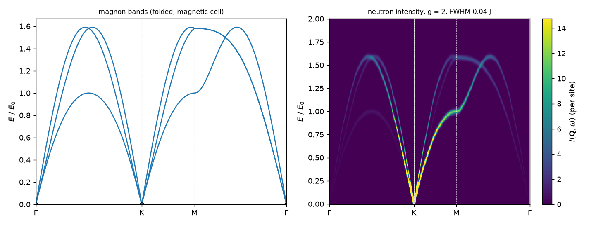
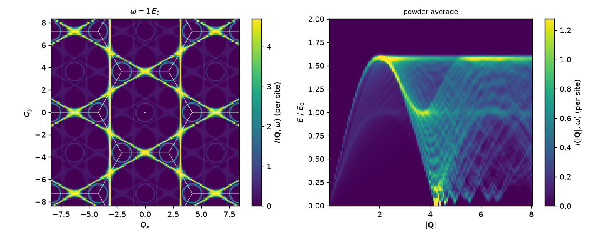
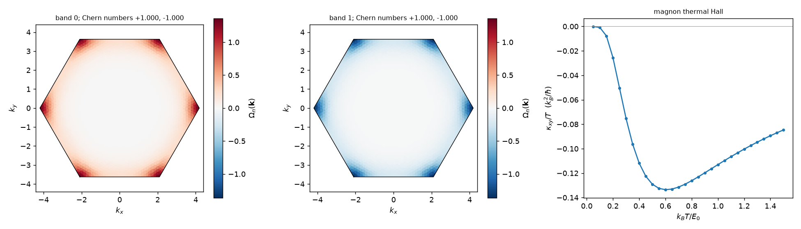
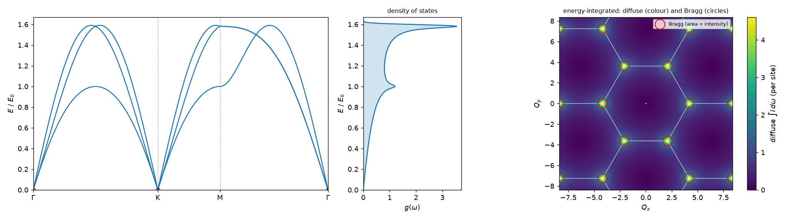
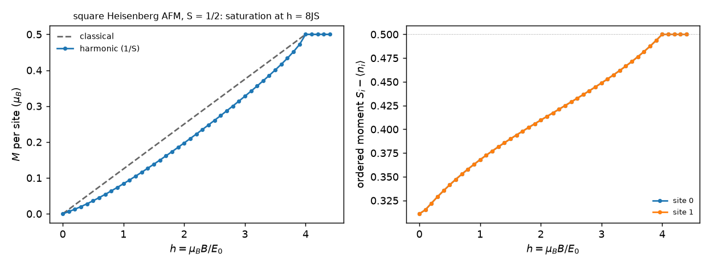
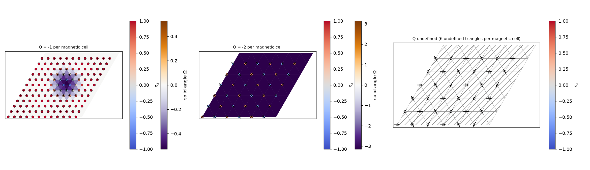

# spin-toolkit

> **Status:** alpha (0.2.0.dev0). Research code under validation; not yet on PyPI.

`spintoolkit` is a Python package for two-dimensional spin models. You write
the Hamiltonian once as a `SpinModel`, find classical ordered states, and
compute linear spin-wave theory (LSWT) and its observables from the same
definition. All quantities are dimensionless: energies are in the unit E0 of
your coupling constants, fields are `μ_B B / E0` and temperatures `k_B T / E0`.

The package grew out of work on the triangular-lattice antiferromagnet
Na₂BaCo(PO₄)₂ (NBCP). That model is the main validation case and is set up in
[`model/nbcp/`](model/nbcp/README.md).

## Features

| Area | What is available |
|---|---|
| Model | Sites, bilinear exchange (any 3×3 matrix), single-ion terms, Zeeman coupling with a g-tensor; symmetry detection on the layer group |
| Classical states | Energy, torques, global search on a magnetic supercell, Luttinger–Tisza, Monte Carlo, Landau–Lifshitz and Langevin dynamics |
| LSWT | `solve_lswt` for commensurate states (Colpa diagonalization, zero-point energy, stability check); rotating-frame LSWT for single-Q spirals |
| Observables | Band structures and density of states; magnetization curve M(h) with the 1/S correction and moment reduction; thermodynamics; dynamical structure factor; unpolarized neutron intensity with form factor, resolution, powder and domain averages; Berry curvature, Chern numbers, magnon thermal Hall; skyrmion number |
| Comparison | `compare_states` ranks candidate states by classical and harmonic (E_cl + E_zp) energy |
| Figures | Bands and density of states, neutron maps (path, constant energy, powder, energy-integrated with Bragg peaks, single spin components), magnetization curves, Berry curvature, thermal Hall, spin textures with skyrmion density, phase diagrams, thermodynamics, spin configurations |
| Exact diagonalization | Small clusters, for checking LSWT |

Spin-wave theory is an expansion about an ordered classical state. The package
reports physically undefined quantities as undefined (NaN or an error), for
example a Chern number at a band touching or the inelastic weight of a
Goldstone mode at a Bragg vector, instead of returning an arbitrary value.

## Installation

Python 3.9 or newer. From a clone of this repository:

```bash
pip install .            # numpy, scipy, matplotlib
pip install ".[dev]"     # adds pytest and tqdm
```

## Quick start

The spin-1/2 Heisenberg antiferromagnet on the triangular lattice, in units
of J. The script is [`examples/quickstart.py`](examples/quickstart.py).

```python
import numpy as np

import spintoolkit as stk
from spintoolkit.models import polarized_state, state_120, triangular_heisenberg
from spintoolkit.observables.bands import band_structure, high_symmetry_points
from spintoolkit.observables.neutron import neutron_intensity
from spintoolkit.observables.thermal import thermal_quantities

# Model (J = 1, S = 1/2) and the 120-degree state on its three-site magnetic cell.
model = triangular_heisenberg(J=1.0, S=0.5)
state = state_120(model)

# Linear spin-wave theory on a 24 x 24 mesh of the magnetic zone.
result = stk.solve_lswt(model, state, settings=stk.LSWTSettings(mesh=(24, 24)))
print(result.ground_state_energy)            # -0.5388 J per spin (E_cl + E_zp)

# Magnon bands along Gamma-K-M-Gamma.
bands = band_structure(result, ("Γ", "K", "M", "Γ"))

# Neutron intensity at M (g = 2), broadened with FWHM 0.05 J.
M = high_symmetry_points(model.lattice)["M"]
spectrum = neutron_intensity(result, [[M[0], M[1], 0.0]], g=2.0)
line = spectrum.broaden(np.linspace(0.0, 3.0, 301), fwhm=0.05)   # peak at 1.0 J

# Thermodynamics of the ferromagnet (J = -1) in a field h = 0.5 along z.
ferro = triangular_heisenberg(J=-1.0, S=0.5)
gapped = stk.solve_lswt(ferro, polarized_state(ferro),
                        stk.ExternalConditions(field=(0.0, 0.0, 0.5)))
thermo = thermal_quantities(gapped, [0.1, 0.5])
```

The energy −0.5388 J agrees with the spin-wave result of Chubukov, Sachdev and
Senthil, J. Phys.: Condens. Matter 6, 8891 (1994).

To define your own model, build `stk.SpinModel` from `stk.Site` and
`stk.Term` objects (see `spintoolkit/models/heisenberg.py` for a short
example) and a `stk.SpinState` for the ordered configuration, or find one with
`spintoolkit.methods.classical.classical_search`.

## Gallery

Every figure below comes from [`examples/gallery.py`](examples/gallery.py),
using one call per plot from `spintoolkit.visualization`. Quantities that are
physically undefined are drawn in grey, never as zero: for example, the
Goldstone weight at the Bragg vector K, or a phase-diagram point where no
candidate state is stable.








## Deprecated API

The first API, built on `SpinSystem` (`SpinSite`, `Coupling`), `LSWTSolver`,
`SpinOptimizer`, `EnergyFunction` and `Topology.compute_thermal_Hall`, still
works in 0.2 and emits a `DeprecationWarning`. It will be removed in 0.3. The
old package name `import lswt` follows the same schedule. New code should use
`SpinModel`, `SpinState` and `solve_lswt`.

## Validation

```bash
python -m pytest code-space/tests -q
```

The tests compare against closed-form results (ferromagnet and Néel magnons,
triangular-lattice zero-point energy, free-spin powder averages), exact
diagonalization of small clusters, and the earlier implementation in
`legacy/`. The NBCP checks live in `examples/nbcp_*.py`, with their outputs in
`data-space/verification/`.

## Known limitations

- Two-dimensional lattices only.
- Incommensurate order is supported only as a single-Q spiral (planar or
  conical) in the rotating frame. The Hamiltonian must be invariant under
  rotations about the spiral axis; otherwise the solver raises an error rather
  than returning an approximation. Multi-Q structures and topology of spiral
  magnons are not supported.
- LSWT is a harmonic expansion about an ordered state. Interactions between
  magnons (1/S corrections beyond the zero-point energy) are not included.
- Thermal Hall integrals in models whose Berry curvature concentrates near
  small avoided crossings (NBCP, for example) converge slowly on a uniform
  mesh; use `AdaptiveIntegration` and check convergence.

Check model conventions, signs and convergence independently before using
results in research.

## Documentation

Most design notes are currently in Korean. English tutorials are planned for
the 0.2 release.

- [Package layout](code-space/spintoolkit/README.md)
- [Development design and decision log](docs/development/README.md)
- [LSWT theory notes](docs/lswt/README.md)
- [NBCP research notes](docs/nbcp/README.md)
- [Documentation index](docs/README.md)

## Related work on NBCP

- Woodland et al., [Phys. Rev. B 112, 104413 (2025)](https://arxiv.org/abs/2505.06398)
- Gao et al., [npj Quantum Materials 7, 89 (2022)](https://doi.org/10.1038/s41535-022-00500-3)

## License

MIT, see [LICENSE](LICENSE).

## Author

Sung-Min Park (sungmin.park.0226@gmail.com)
