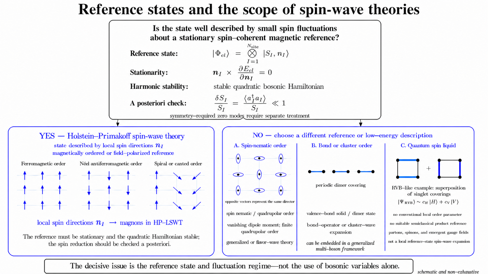

# Spin-Wave Theory Overview

Spin-wave theory (SWT) describes low-energy collective spin excitations and the associated quantum fluctuations about an ordered reference state. The nature of that reference state determines the appropriate formulation: local spin directions describe magnetically ordered or field-polarized states, whereas multipolar and bond-ordered phases require enlarged local or cluster reference states. Phases without a suitable semiclassical product reference require a different low-energy description.

For states described by local spin directions, SWT is most commonly formulated using SU(2) spin-coherent states and Holstein–Primakoff bosons. Linear spin-wave theory (LSWT) is the harmonic approximation obtained by retaining terms up to quadratic order in these bosons.

*The classification is schematic and non-exhaustive. A compatible stationary reference and a stable quadratic Hamiltonian are prerequisites for Holstein–Primakoff LSWT, whereas a small spin reduction is an a posteriori check of the harmonic approximation.*

## Holstein–Primakoff Spin-Wave Theory

For spin length $S_I$ and a local unit vector $\mathbf n_I$, the reference configuration is represented by the spin-coherent product state

$$
|\Phi_{\mathrm{cl}}[\{\mathbf n_I\}]\rangle
=
\bigotimes_I |S_I,\mathbf n_I\rangle,
\qquad
\langle\Phi_{\mathrm{cl}}|
\hat{\mathbf S}_I
|\Phi_{\mathrm{cl}}\rangle
=
S_I\mathbf n_I.
$$

The classical energy associated with this reference state is

$$
E_{\mathrm{cl}}[\{\mathbf n_I\}]
=
\langle\Phi_{\mathrm{cl}}[\{\mathbf n_I\}]|
\hat H
|\Phi_{\mathrm{cl}}[\{\mathbf n_I\}]\rangle.
$$

The product state is the semiclassical expansion point, not an assertion that the exact quantum state is unentangled or has an ordered moment of magnitude $S_I$. The Holstein–Primakoff representation maps deviations from the local directions $\mathbf n_I$ to bosons, and the quadratic Hamiltonian describes their collective normal modes as magnons. The local-frame construction and bosonic expansion are developed in [Classical Order and Local Frame](classical-order-and-local-frame.md) and [Holstein–Primakoff Expansion](../01-derivation/holstein-primakoff-expansion.md).

## Validity of Holstein–Primakoff LSWT

The existence of a spin-coherent reference configuration permits a Holstein–Primakoff representation to be constructed, but it does not by itself establish that LSWT is an appropriate approximation. Its prerequisites and self-consistency check have different logical roles:

- **Reference compatibility:** the state of interest must admit a low-energy description in terms of fluctuations about a local spin-coherent configuration.
- **Stationarity:** the reference configuration must satisfy $\mathbf n_I\times\partial E_{\mathrm{cl}}/\partial\mathbf n_I=0$, so that no term linear in the fluctuation bosons remains.
- **Harmonic stability:** the quadratic expansion must define a stable bosonic problem. The precise energetic and dynamical stability conditions, including the treatment of symmetry-required zero modes, belong to [Paraunitary Diagonalization](../01-derivation/paraunitary-diagonalization.md).
- **A posteriori self-consistency:** after diagonalization, the local spin reduction $\delta S_I=\langle\hat a_I^\dagger\hat a_I\rangle$ should satisfy $\delta S_I/S_I\ll1$ wherever the harmonic approximation is used.

Failure of a prerequisite invalidates Holstein–Primakoff LSWT about the selected reference, whereas a large spin reduction signals that neglected interaction terms may be important. Neither conclusion rules out every possible spin-wave description. The momentum-space derivation developed here also assumes a commensurate reference configuration with a finite magnetic unit cell; this is a restriction of that derivation rather than a general limitation of SWT.

In two dimensions, the finite-temperature interpretation requires an additional qualification. A short-range isotropic Heisenberg model cannot sustain spontaneous ferromagnetic or antiferromagnetic long-range order at nonzero temperature. Consequently, a thermodynamic ordered-state interpretation of finite-temperature LSWT requires a symmetry-breaking field, anisotropy that removes the relevant continuous spin-rotation symmetry, interlayer coupling, a finite-size or crossover scale, or another physical infrared cutoff.

## Reference States Beyond Local Magnetic Order

States without a local magnetic direction require a different reference state. Spin-nematic states with quadrupolar order but no magnetic dipole moment provide a representative example. Flavor-wave theory enlarges the local state space and can describe quadrupolar or higher multipolar order. Bond-operator and cluster-wave theories instead expand about singlet dimers or larger local units. These approaches may retain a harmonic bosonic structure, but their fluctuation variables are not Holstein–Primakoff bosons about local spin directions. Multipolar moments can also coexist with magnetic dipole order, so the absence of a local spin direction is not a defining property of all multipolar phases.

A quantum spin liquid has no suitable semiclassical product reference for a local spin-wave expansion. Its low-energy description may instead involve fractionalized spinons and emergent gauge fields. The use of bosonic variables alone therefore does not determine whether a formulation is a spin-wave theory; the reference state and fluctuation expansion must also be specified.

## Bilinear Spin Hamiltonians

The Hamiltonian considered in the subsequent derivation is at most bilinear in the spin operators and can be written as

$$
\hat H
=
\sum_{\ell=(I,J)\in\mathcal L}
\hat{\mathbf S}_I
\mathbin{\cdot}
\mathsf J_\ell
\mathbin{\cdot}
\hat{\mathbf S}_J
+
\sum_I
\hat{\mathbf S}_I
\mathbin{\cdot}
\mathsf D_I
\mathbin{\cdot}
\hat{\mathbf S}_I
-
\sum_I
\mathbf h_I
\mathbin{\cdot}
\hat{\mathbf S}_I.
$$

The inter-site matrix $\mathsf J_\ell$ includes isotropic Heisenberg exchange, antisymmetric Dzyaloshinskii–Moriya interaction, and symmetric anisotropic exchange, including bond-dependent Kitaev-type couplings. The on-site matrix $\mathsf D_I$ represents single-ion anisotropy, and $\mathbf h_I$ is the Zeeman-energy coefficient determined by the applied field and the material-dependent $g$-tensor. Link orientation, counting conventions, and the relation between $\mathbf h_I$, the applied field, and the $g$-tensor are defined in [Bilinear Spin Hamiltonian](bilinear-spin-hamiltonian.md).

Genuine higher-order interactions, such as inter-site biquadratic coupling and four-spin ring exchange, lie outside this bilinear Hamiltonian class. Spin-wave expansions can be constructed for such models, but the resulting harmonic coefficients must be derived from those interactions rather than inferred from the bilinear formulas above.

## References

### Internal Documents

- [Notation and Conventions](notation-and-conventions.md): defines the symbols, indices, geometry, and matrix typography used here.
- [Bilinear Spin Hamiltonian](bilinear-spin-hamiltonian.md): defines the Hamiltonian support and link-counting convention.
- [Classical Order and Local Frame](classical-order-and-local-frame.md): defines the reference configuration and local-frame convention.
- [Holstein–Primakoff Expansion](../01-derivation/holstein-primakoff-expansion.md): defines the bosonic representation and harmonic truncation.
- [Real-Space Boson Hamiltonian](../01-derivation/real-space-boson-hamiltonian.md): derives the quadratic Hamiltonian in real space.
- [Momentum-Space BdG Hamiltonian](../01-derivation/momentum-space-bdg-hamiltonian.md): defines the Fourier and Nambu conventions.
- [Paraunitary Diagonalization](../01-derivation/paraunitary-diagonalization.md): states the stability conditions and obtains the magnon modes.

### External Sources

- T. Holstein and H. Primakoff, [*Field Dependence of the Intrinsic Domain Magnetization of a Ferromagnet*](https://doi.org/10.1103/PhysRev.58.1098), *Physical Review* **58**, 1098–1113 (1940), DOI: `10.1103/PhysRev.58.1098`: introduces the Holstein–Primakoff boson representation.
- S. Toth and B. Lake, [*Linear spin wave theory for single-$Q$ incommensurate magnetic structures*](https://doi.org/10.1088/0953-8984/27/16/166002), *Journal of Physics: Condensed Matter* **27**, 166002 (2015), DOI: `10.1088/0953-8984/27/16/166002`: formulates LSWT using local spin frames and discusses its small-fluctuation regime.
- R. A. Muniz, Y. Kato, and C. D. Batista, [*Generalized spin-wave theory: application to the bilinear-biquadratic model*](https://doi.org/10.1093/ptep/ptu109), *Progress of Theoretical and Experimental Physics* **2014**, 083I01 (2014), DOI: `10.1093/ptep/ptu109`: distinguishes the SU(2) spin-coherent formulation from generalized spin-wave theories for multipolar states.
- L. Balents, [*Spin liquids in frustrated magnets*](https://doi.org/10.1038/nature08917), *Nature* **464**, 199–208 (2010), DOI: `10.1038/nature08917`: reviews quantum spin liquids, fractionalized excitations, and emergent gauge fields.
- S. Sachdev and R. N. Bhatt, [*Bond-operator representation of quantum spins: Mean-field theory of frustrated quantum Heisenberg antiferromagnets*](https://doi.org/10.1103/PhysRevB.41.9323), *Physical Review B* **41**, 9323–9329 (1990), DOI: `10.1103/PhysRevB.41.9323`: introduces the singlet–triplet bond-operator expansion used for dimerized quantum magnets.
- K. Majumdar, D. Furton, and G. S. Uhrig, [*Effects of ring exchange interaction on the Néel phase of two-dimensional, spatially anisotropic, frustrated Heisenberg quantum antiferromagnet*](https://doi.org/10.1103/PhysRevB.85.144420), *Physical Review B* **85**, 144420 (2012), DOI: `10.1103/PhysRevB.85.144420`: provides a spin-wave treatment of a Hamiltonian containing four-spin ring exchange.
- N. D. Mermin and H. Wagner, [*Absence of Ferromagnetism or Antiferromagnetism in One- or Two-Dimensional Isotropic Heisenberg Models*](https://doi.org/10.1103/PhysRevLett.17.1133), *Physical Review Letters* **17**, 1133–1136 (1966), DOI: `10.1103/PhysRevLett.17.1133`: establishes the absence of spontaneous ferro- or antiferromagnetic long-range order at nonzero temperature in the short-range isotropic one- and two-dimensional Heisenberg model.
