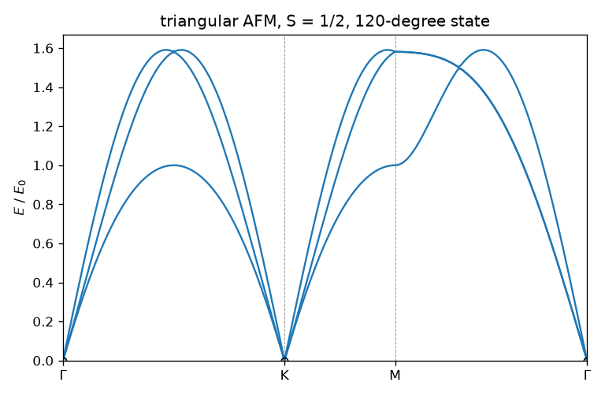

# 1. First calculation: the triangular-lattice antiferromagnet

Script: [`examples/tutorials/t01_first_calculation.py`](../../examples/tutorials/t01_first_calculation.py)

We compute the spin-wave spectrum and ground-state energy of the spin-1/2
Heisenberg antiferromagnet on the triangular lattice,

$$H = J \sum_{\langle ij \rangle} \mathbf{S}_i \cdot \mathbf{S}_j, \qquad J = 1,\ S = 1/2.$$

## The model

```python
import spintoolkit as stk
from spintoolkit.models import state_120, triangular_heisenberg

model = triangular_heisenberg(J=1.0, S=0.5)
```

A `SpinModel` holds the Bravais lattice (rows are primitive vectors, here
(1, 0) and (1/2, √3/2)), the sites of the unit cell, and a list of terms.
This one has one site `A`, three bonds per site, and a Zeeman term that is
inactive until you apply a field. Tutorial 2 shows how to build a model
yourself.

## The ordered state

```python
state = state_120(model)
```

A `SpinState` gives the classical spin direction on every site of a magnetic
supercell. The 120° state has three sites, along (1, 0, 0),
(−1/2, −√3/2, 0) and (−1/2, √3/2, 0). Its classical energy is
E_cl = −(3/2)JS² = −0.375 J per spin.

## Linear spin-wave theory

```python
result = stk.solve_lswt(model, state, settings=stk.LSWTSettings(mesh=(24, 24)))
```

`solve_lswt` writes each spin as S_i = S n_i + (Holstein–Primakoff bosons),
keeps the quadratic part, and diagonalizes it with Colpa's method on a
24 × 24 mesh of the magnetic Brillouin zone. The script prints

```
E_cl  = -0.3750 J per spin
E_zp  = -0.1638 J per spin
E_gs  = -0.5388 J per spin
```

The ground-state energy E_gs = E_cl + E_zp includes the zero-point energy of
the magnons, the first 1/S correction. The value −0.5388 J agrees with
Chubukov, Sachdev and Senthil, J. Phys.: Condens. Matter 6, 8891 (1994).
`solve_lswt` warns when the state is not a classical stationary point
(linear boson terms remain, so the expansion is inconsistent), and it raises
`LSWTError` when H(k) has a negative mode, which means the state is unstable.
It does not return a spectrum with imaginary energies.

## Bands

```python
from spintoolkit.observables.bands import band_structure
from spintoolkit.visualization import plot_bands

bands = band_structure(result, ("Γ", "K", "M", "Γ"))
plot_bands(bands)
```



The three bands are the single magnon band ω_k of the primitive zone, folded
into the smaller magnetic zone (it shows up at k, k + Q and k − Q). The
closed form is

$$\omega_{\mathbf{k}} = 3JS\sqrt{(1 - \gamma_{\mathbf{k}})(1 + 2\gamma_{\mathbf{k}})},
\qquad \gamma_{\mathbf{k}} = \tfrac{1}{3}\sum_{\boldsymbol{\delta}} \cos(\mathbf{k}\cdot\boldsymbol{\delta}),$$

so at M, where γ = −1/3, ω = 1.0 J. The script prints
`magnon energies at M: [1. 1.5811 1.5811]`; the lowest is the unfolded band
at M. The other two come from M ± Q. The bands go to zero at Γ and K. These
are the three Goldstone modes of the noncollinear state.

## Convergence

```
mesh  24: E_gs = -0.538803  <S> = 0.2484
mesh  48: E_gs = -0.538808  <S> = 0.2436
mesh  96: E_gs = -0.538809  <S> = 0.2411
```

The energy converges fast. The ordered moment S − ⟨n⟩ converges slowly,
roughly as 1/N_mesh, because ⟨n_k⟩ grows like 1/ω_k near the Goldstone
modes, which a finite mesh samples poorly. Extrapolating the last two meshes
linearly in 1/N gives about 0.239, the published spin-wave value
S − 0.261 (Chubukov et al., 1994). Always check the
mesh for quantities that are sensitive to gapless modes.

## What the result contains

`result` is an `LSWTResult`. Its main fields are `classical_energy`,
`zero_point_energy`, `ground_state_energy`, `bands()`, `ordered_moments()`,
`k_points`, `eigenvalues` and `eigenvectors` (paraunitary, Colpa order). It
also has `hamiltonian_at(k)`, which gives H(k) at any momentum. All
observables in the later tutorials take this object as input.
