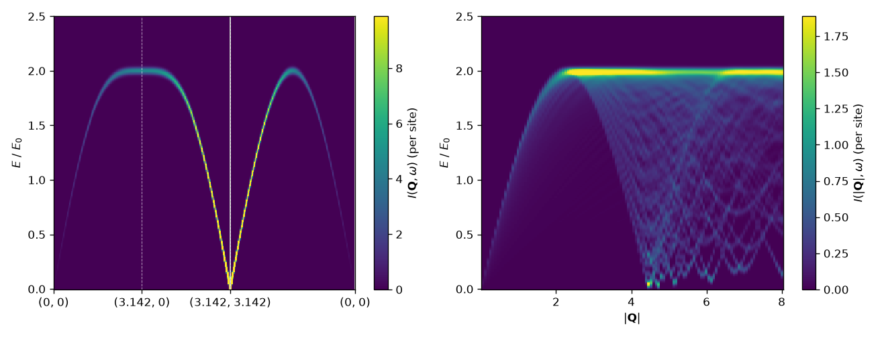

# 3. Neutron scattering: the square-lattice antiferromagnet

Script: [`examples/tutorials/t03_neutron.py`](../../examples/tutorials/t03_neutron.py)

This tutorial computes the inelastic neutron intensity I(Q, ω) of the
spin-1/2 Heisenberg antiferromagnet on the square lattice (J = 1). The Néel
moments point along z, g = 2, and the magnetic form factor is 1. The
harmonic-order result has a closed form, so every number can be checked.

```python
import spintoolkit as stk
from spintoolkit.models import neel_state, square_heisenberg
from spintoolkit.observables.neutron import neutron_intensity

model = square_heisenberg(J=1.0, S=0.5)
result = stk.solve_lswt(model, neel_state(model), settings=stk.LSWTSettings(mesh=(24, 24)))
spectrum = neutron_intensity(result, Q, g=2.0)
```

## What is computed

`neutron_intensity` returns, for each momentum transfer Q and each magnon
mode n, the energy ω_n(Q) and the weight

$$I_n(\mathbf{Q}) = \sum_{ab} \left(\delta_{ab} - \hat Q_a \hat Q_b\right)
\left(\tfrac{g}{2}\right)^2 |F(Q)|^2\, S^{ab}_n(\mathbf{Q})$$

per site, at temperature zero unless you pass `temperature`. Here S^{ab}_n is
the one-magnon spin correlation. `spectrum.broaden(omega, fwhm)` turns the
modes into I(Q, ω) with Gaussian (or Lorentzian) resolution, and `fwhm` may
be a function of energy. `spectrum.elastic` holds the Bragg weight.

Q is Cartesian, in inverse units of the model's length, here the lattice
constant. Pass `length_unit` (in Å) to evaluate a real form factor
(`FormFactor`), or give a g-tensor per site.

## Closed-form check

For Néel order along z the magnon energy and the transverse correlation are

$$\omega_{\mathbf{q}} = 4JS\sqrt{1-\gamma_{\mathbf{q}}^2}, \qquad
S^{xx}(\mathbf{q}) = S^{yy}(\mathbf{q}) = \frac{S}{2}\sqrt{\frac{1-\gamma_{\mathbf{q}}}{1+\gamma_{\mathbf{q}}}},
\qquad \gamma_{\mathbf{q}} = \tfrac12(\cos q_x + \cos q_y).$$

With Q in the plane and g = 2, the polarization factor keeps
S^{xx}(1 − Q̂_x²) + S^{yy}(1 − Q̂_y²) = S^{xx}. The longitudinal part S^{zz}
has no one-magnon weight. The script prints

```
Q = (1.00, 0.00) pi: omega = 2.0000 (closed form 2.0000), I = 0.2500 (closed form 0.2500)
Q = (0.50, 0.50) pi: omega = 2.0000 (closed form 2.0000), I = 0.2500 (closed form 0.2500)
Q = (0.50, 0.00) pi: omega = 1.7321 (closed form 1.7321), I = 0.1443 (closed form 0.1443)
Q = (0.90, 0.90) pi: omega = 0.6180 (closed form 0.6180), I = 1.5784 (closed form 1.5784)
```

The intensity grows as Q approaches the ordering vector (π, π), where
ω → 0.

## At the Bragg vector

```
at (pi, pi): inelastic [nan nan nan nan]  elastic 0.0987  <S>^2 = 0.0987
```

At Q = (π, π) the magnon is a Goldstone mode with ω = 0, and its weight
diverges as 1/ω. Linear spin-wave theory does not give a finite inelastic
weight there, so the package returns NaN rather than a number. The elastic
(Bragg) weight is finite and equals the ordered moment squared, ⟨S⟩² with
⟨S⟩ = S − ⟨n⟩, as it should for a moment perpendicular to Q.

## Maps and powder averages

```python
from spintoolkit.observables.neutron import neutron_path, powder_average
from spintoolkit.visualization import plot_intensity_path, plot_powder

path = neutron_path(result, omega, 0.05, path=[(0, 0), (np.pi, 0), (np.pi, np.pi), (0, 0)], g=2.0)
powder = powder_average(result, Q_magnitudes, omega, 0.05, num_directions=400, g=2.0)
```



The intensity is not periodic in the Brillouin zone because of the
polarization factor and the form factor, so give paths beyond the first zone
as explicit Cartesian momenta. `neutron_slice` gives constant-energy maps,
`static_slice` the energy-integrated intensity with Bragg peaks,
`correlation_path` a single component S^{ab}(q, ω), and `domain_average`
averages over magnetic domains.
