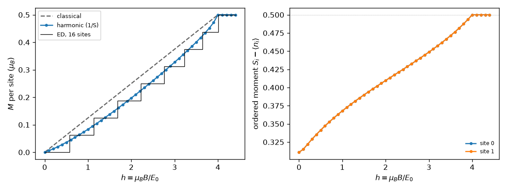

# 4. Magnetization curve at 1/S order, checked by exact diagonalization

Script: [`examples/tutorials/t04_magnetization.py`](../../examples/tutorials/t04_magnetization.py)

This tutorial computes the magnetization M(h) of the spin-1/2 square-lattice
Heisenberg antiferromagnet (J = 1, g = 1) in a field along z, then compares
it with exact diagonalization (ED) of a 16-site cluster. Classically the
moments cant towards the field and saturate at h_sat = 8JS = 4.

## The calculation

```python
from spintoolkit.methods.magnetization import magnetization_curve
from spintoolkit.models import neel_state, square_heisenberg

model = square_heisenberg(J=1.0, S=0.5)
curve = magnetization_curve(model, neel_state(model, (1, 0, 0)),
                            np.linspace(0.0, 4.4, 45), k_density=48)
```

The Néel state starts perpendicular to the field. At each field the
classical state is re-optimized (the canting angle follows h) and LSWT is
solved about it. The curve holds

- `curve.classical`: M_cl = −dE_cl/dh;
- `curve.harmonic`: M = −d(E_cl + E_zp)/dh, the magnetization to first
  order in 1/S, NaN where LSWT is unstable;
- `curve.ordered_moments`: S − ⟨n_i⟩ on every site.

```
chi at h = 0.1: classical 0.1250, 1/S 0.0600
h = 1.0: classical 0.1250  1/S 0.0837  S - <n> = 0.3679
h = 2.0: classical 0.2500  1/S 0.1974  S - <n> = 0.4096
h = 3.0: classical 0.3750  1/S 0.3276  S - <n> = 0.4488
```

## Why M = −d(E_cl + E_zp)/dh and not g(S − ⟨n⟩)cos θ

By the Hellmann–Feynman theorem M = −dE_gs/dh exactly. To first order in
1/S, E_gs = E_cl(θ_cl) + E_zp(θ_cl), where θ_cl is the classical canting
angle from the field axis. Differentiating, and using ∂E_cl/∂θ = 0 at θ_cl,

$$M = g\left(S - \langle n\rangle\right)\cos\theta_{cl}
      - gS\sin\theta_{cl}\,\delta\theta,
\qquad \delta\theta = -\frac{\partial_\theta E_{zp}}{\partial^2_\theta E_{cl}}.$$

The first term is the familiar "reduced moment times cos θ". The second is
the 1/S shift δθ of the canting angle. It is of the same order, so a 1/S
calculation must keep it. Equivalently, it comes from the transverse moment
generated by the cubic boson terms. In a field the Goldstone mode (rotation
about the field axis) makes ⟨n⟩ diverge at isolated momenta, and the formula
g(S − ⟨n⟩)cos θ needs that mode removed by hand. The energy derivative does
not, since a zero mode adds nothing to E_zp. For these reasons the package
uses −d(E_cl + E_zp)/dh by a central difference.

## Comparison with exact diagonalization

`solve_ed` diagonalizes the model on a finite torus. Its blocks are labelled
by the conserved S^z (`magnon_number` counts the deviations from full
polarization) and by momentum:

```python
from spintoolkit.methods.ed import EDSector, solve_ed
from spintoolkit.system.geometry import CalculationGeometry

geometry = CalculationGeometry.finite_torus([[4, 0], [0, 4]])
sector = EDSector(axis=(0, 0, 1), magnon_number=n, momenta="all")
blocks = solve_ed(model, geometry, sector=sector, num_eigenvalues=1).blocks
```

The script finds the lowest zero-field energy E(S^z) in each sector. The
ground state at field h minimizes E(S^z) − h S^z, which gives the staircase
in the figure.



On a finite cluster M jumps in steps of 1/N. The fairest comparison is at
the centre of each ED plateau:

```
ED plateau M = 0.125 centred at h = 1.41: classical 0.175  1/S 0.127
ED plateau M = 0.250 centred at h = 2.49: classical 0.312  1/S 0.260
ED plateau M = 0.375 centred at h = 3.44: classical 0.425  1/S 0.385
```

The 1/S curve is much closer to ED than the classical one. At low field the
1/S susceptibility, 0.060, is close to the quantum Monte Carlo value
χ⊥ = 0.0657 (arXiv:2601.20189), while the classical value is 1/8.

How good the 1/S result is varies by system. In more extensive checks
(square S = 1/2 and S = 1, XXZ, honeycomb, ED clusters up to 26 sites, and
site-by-site on open clusters against ED and DMRG), −d(E_cl + E_zp)/dh was
closer to the exact value than g(S − ⟨n⟩)cos θ in almost all cases. It was
not closer everywhere. Near the corners of open clusters at intermediate
field, the next order (1/S²) is large, and the simpler formula was sometimes
closer by cancellation of errors. For S = 1 the remaining error is about
four times smaller than for S = 1/2, as expected for a 1/S² term.
