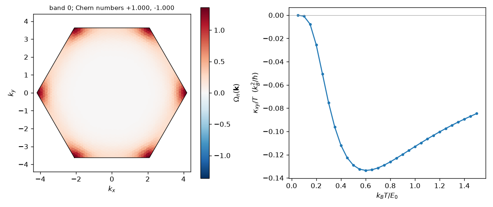

# 5. Topology: Berry curvature, Chern numbers and the magnon thermal Hall effect

Script: [`examples/tutorials/t05_topology.py`](../../examples/tutorials/t05_topology.py)

The honeycomb ferromagnet with a next-nearest-neighbour Dzyaloshinskii–Moriya
(DM) interaction is the magnon analogue of the Haldane model:

$$H = -J\sum_{\langle ij\rangle}\mathbf{S}_i\cdot\mathbf{S}_j
     + D\sum_{\langle\langle ij\rangle\rangle}\nu_{ij}\,\hat z\cdot(\mathbf{S}_i\times\mathbf{S}_j)
     - h\sum_i S_i^z,$$

with ν_ij = ±1 as in the Haldane model, J = 1, S = 1/2, D = 0.1 and h = 0.1.

```python
import spintoolkit as stk
from spintoolkit.models import honeycomb_ferromagnet, polarized_state

model = honeycomb_ferromagnet(J=1.0, D=0.1, S=0.5)
result = stk.solve_lswt(model, polarized_state(model), stk.ExternalConditions(field=(0, 0, 0.1)),
                        settings=stk.LSWTSettings(mesh=(48, 48)))
```

## Bands

Without DM the two magnon bands touch at K in a Dirac cone. The DM term opens
a gap there, and the bands at K are 3JS + h ∓ 3√3 DS:

```
bands at K: [1.3402 1.8598]  closed form: [1.3402 1.8598]
```

## Chern numbers

```python
from spintoolkit.observables.berry import berry_curvature, chern_numbers

chern_numbers(result)         # array([ 1., -1.]), bands in ascending energy
```

`chern_numbers` computes each Chern number in two independent ways:

- the integral of the Berry curvature (Kubo formula), and
- the lattice plaquette method of Fukui, Hatsugai and Suzuki (FHS).

It returns the integer only when the two agree. FHS always gives an integer,
even where the gap closes and the answer means nothing. The Kubo integral
moves away from an integer in that case, or when the mesh is too coarse.
Requiring both to agree catches either problem. The result here is the same
on 24 × 24, 48 × 48 and 96 × 96 meshes.

At D = 0 the bands touch at K, the Chern number is not defined, and the
package returns NaN instead of an integer:

```
D = 0: [nan nan]
```



The curvature of the lower band is concentrated near K and K′, where the gap
is smallest.

## Thermal Hall conductivity

```python
from spintoolkit.observables.berry import thermal_hall

hall = thermal_hall(result, [0.1, 0.3, 0.5, 1.0])
hall.kappa_over_t
```

This is the Matsumoto–Murakami formula,

$$\frac{\kappa_{xy}}{T} = -\frac{k_B^2}{\hbar}\,\frac{1}{A_{cell}}
\Big\langle\sum_n c_2(\rho_n)\,\Omega_n(\mathbf{k})\Big\rangle_{\mathbf{k}},$$

per layer, in units of k_B²/ħ. Multiply by k_B² T/ħ for watts per kelvin,
and divide by the layer spacing for a bulk conductivity.

```
T = 0.1: kappa_xy / T = -0.0009
T = 0.3: kappa_xy / T = -0.0754
T = 0.5: kappa_xy / T = -0.1290
T = 1.0: kappa_xy / T = -0.1131
D -> -D: [0.0009 0.0754 0.129  0.1131]
```

At low T the response is activated across the magnon gap, which is h here.
Reversing D reverses its sign. The Bloch Hamiltonians satisfy
H_{−D}(k) = H_D(−k)^*, which you can check with `result.hamiltonian_at`.
This relation maps Ω_n(k) to −Ω_n(−k), so the Chern numbers and κ_xy change
sign.

The Berry curvature here uses the full-position Bloch convention (the phase
e^{ik·r} uses each site's actual position). This is the convention in which
κ_xy is physical. Chern numbers are the same in either convention. The
evaluation is in pair form, so degenerate or crossing bands are handled.
Only a zero mode on the mesh leaves κ_xy undefined, which is reported as
NaN. `thermal_hall` also accepts an `AdaptiveIntegration` to refine the mesh
where the curvature is concentrated.
